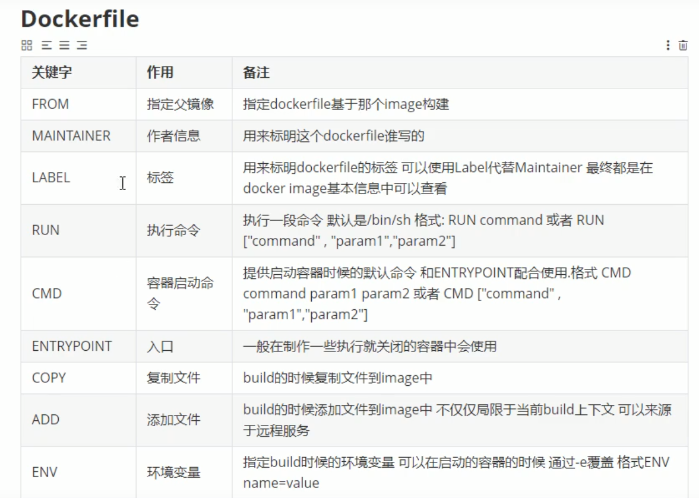
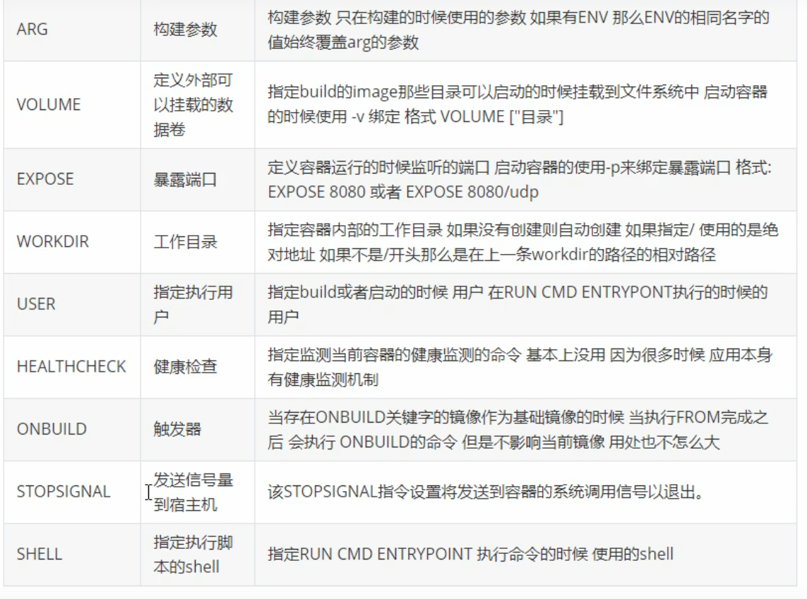
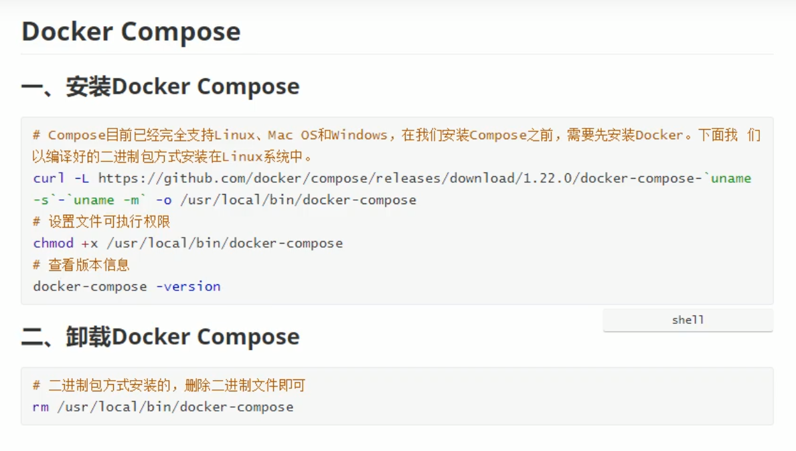
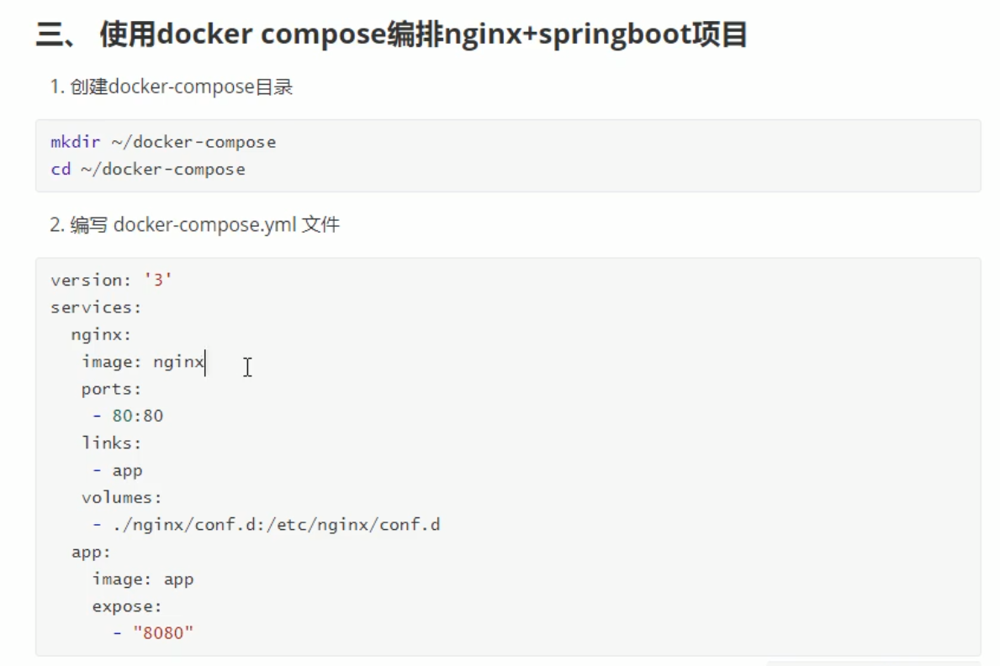
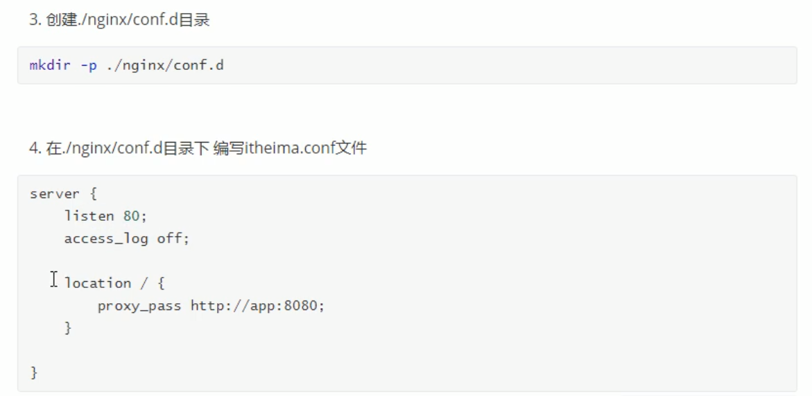
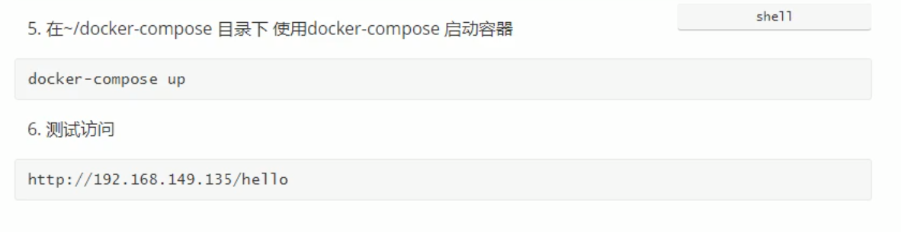
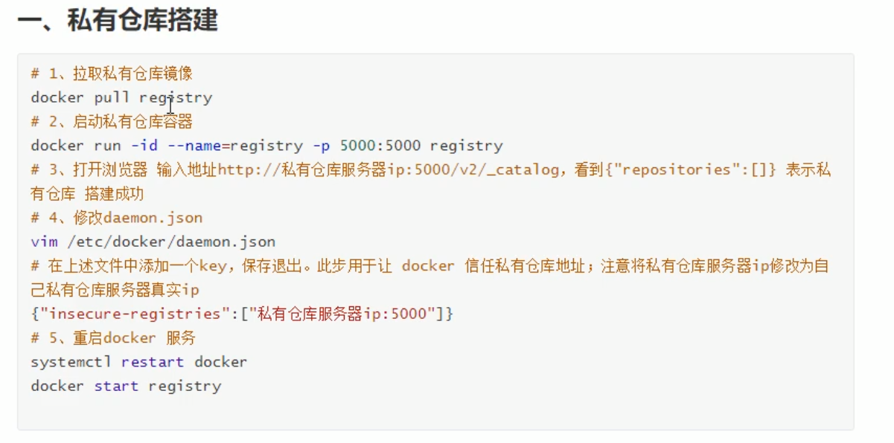
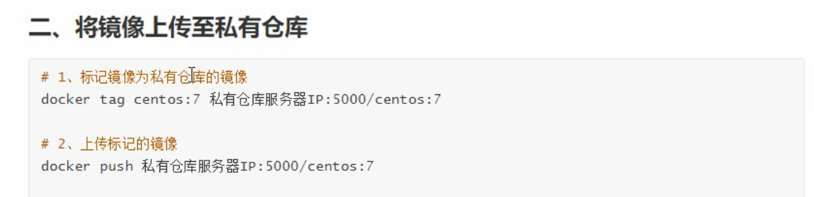

## 简介

- 不同环境的操作系统不同，Docker如何解决的
  - 将用户程序（配置、依赖）和需要用到的系统函数库一起打包（镜像），只要内核相同都可以运行
  - 互相隔离，沙箱机制
- 与虚拟机的差别
  - docker是容器虚拟化，虚拟的是操作系统，虚拟机虚拟的是硬件
  - 虚拟机可以运行不同的操作系统，容器只能运行同一类型的操作系统
  - docker性能更好，硬盘占用小，秒级启动速度，支持上千个容器
- 镜像
  - docker将用户程序（配置、依赖）和需要用到的系统函数库一起打包为一个镜像
- 容器
  - 运行镜像形成的进程就是容器，docker会给容器做隔离，对外不可见

## 架构

- CS架构
  - 服务端：Docker守护线程（Docker Daemon），负责处理Docker命令，管理镜像、容器
  - 客户端：向Docker发送命令

## 常用命令

| 效果                   | 指令                           | 可选参数                       | 参数说明                                                     |
| ---------------------- | ------------------------------ | ------------------------------ | ------------------------------------------------------------ |
| 拉取镜像               | docker pull                    |                                |                                                              |
| 查看镜像               | docker images                  |                                |                                                              |
| 推送/发布 镜像         | docker push                    |                                |                                                              |
| 压缩镜像               | docker save                    | -o                             | 压缩包名称                                                   |
| 解压缩镜像             | docker load                    |                                |                                                              |
| 查看运行中的容器       | docker ps                      | -a                             | 查看所有                                                     |
| 删除容器               | docker rm id                   | r m i -f                  | 删除镜像 强制删除                                       |
| 创建容器               | docker run  {相关参数}  镜像名 | -v --name -p -d | {外部路径:内部路径} 容器名称 端口映射 宿主机 : 容器 后台运行 |
| 进入容器               | docker exec{容器名}            | -it  bash                 | 允许与容器交互（输入/出） 终端交互命令                  |
| 查看容器日志           | docker logs                    | -f                             | 实时打印日志                                                 |
| 查看容器内部配置信息   | docker inspect                 |                                |                                                              |
| 关闭/开启/重启容器     | docker stop/start/restart      |                                |                                                              |
| 将DockerFile构建为镜像 | docker build                   |                                |                                                              |

## 常用操作

- 容器转镜像
  - docker commit 容器id 镜像名称:版本号
  - docker save -o 压缩文件名称 镜像名称:版本号
  - docker load -i 压缩文件名称

## DockerFile

- 
- 

## Docker Compose

- 
- 
- 
- 

## 私有仓库

- 
- 

## Docker创建Redis容器

- `docker run --name redis -p 6379:6379 -d redis redis-server --appendonly yes `
  - `--appendonly yes `  开启aof持久化
