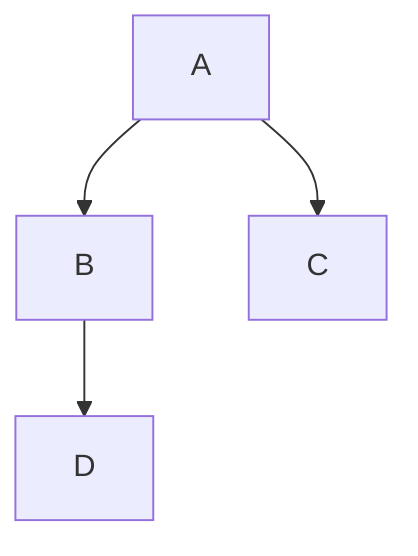
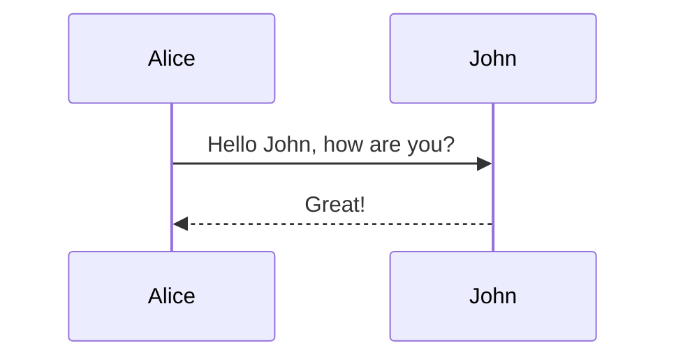
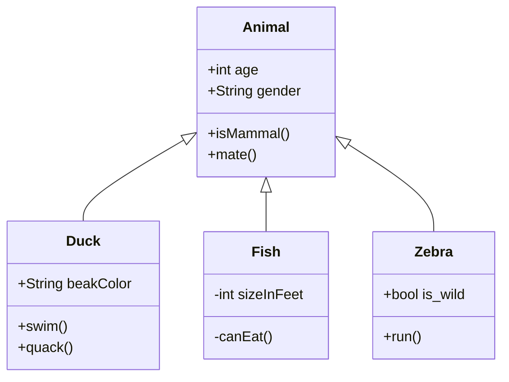
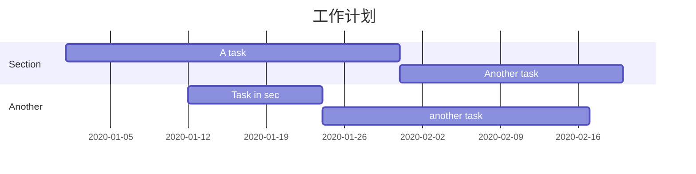
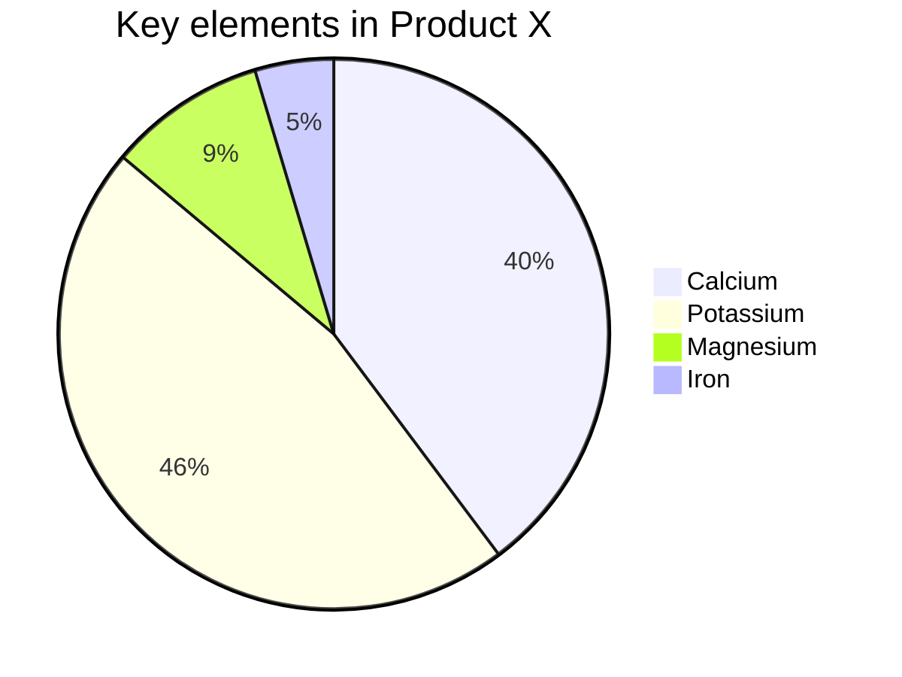

## 画图

Mermaid 支持绘制非常多种类的图，常见的有时序图、流程图、类图、甘特图等等。下面分享一下如何绘制这些图，语法非常容易掌握。

先在 Typora 中，输入 **```mermaid** 然后敲击回车，即可初始化一张空白图

### 流程图


```mermaid
graph TD;
    A-->B;
    A-->C;
    B-->D;
```

### 时序图


```mermaid
sequenceDiagram
    Alice->>John: Hello John, how are you?
    John-->>Alice: Great!
```

### 状态图


```mermaid
stateDiagram
    [*] --> s1
    s1 --> [*]
```

### 类图


```mermaid
classDiagram
      Animal <|-- Duck
      Animal <|-- Fish
      Animal <|-- Zebra
      Animal : +int age
      Animal : +String gender
      Animal: +isMammal()
      Animal: +mate()
      class Duck{
          +String beakColor
          +swim()
          +quack()
      }
      class Fish{
          -int sizeInFeet
          -canEat()
      }
      class Zebra{
          +bool is_wild
          +run()
      }
```

### 甘特图


```mermaid
gantt
    title 工作计划
    dateFormat  YYYY-MM-DD
    section Section
    A task           :a1, 2020-01-01, 30d
    Another task     :after a1  , 20d
    section Another
    Task in sec      :2020-01-12  , 12d
    another task      : 24d
```

### 饼图


```mermaid
pie
    title Key elements in Product X
    "Calcium" : 42.96
    "Potassium" : 50.05
    "Magnesium" : 10.01
    "Iron" :  5
```

