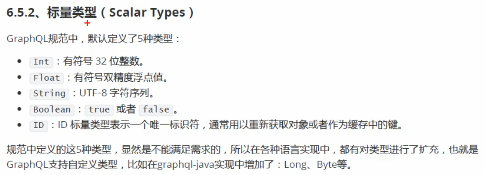
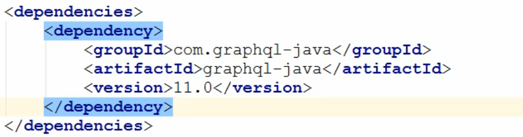
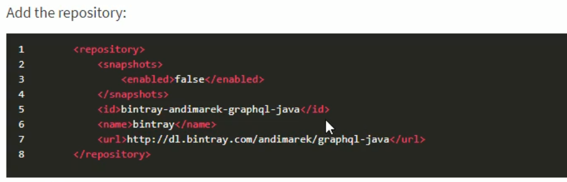

# GraphQL

- Restful存在的弊端
  - 想要部分数据，但是返回的有多余的数据，资源浪费
  - 一次请求不能满足需求
- 按需索取资源、一次查询多个数据、无需划分版本
- 
  - 
  - 
  - 
  - 
- GraphQL-Java
  - 
    - 需要添加第三方库才能下载使用，Maven配置第三方库
      - 

  - 使用SDL构建
    - 在resources下创建user.graphqls
      - 

    - 
    - 
    - 
  - 对象嵌套
  - 参数可以是变量，服务器需要处理变量，