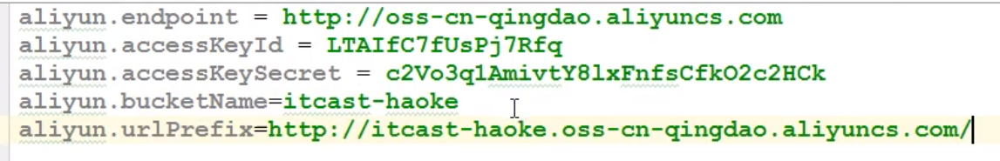
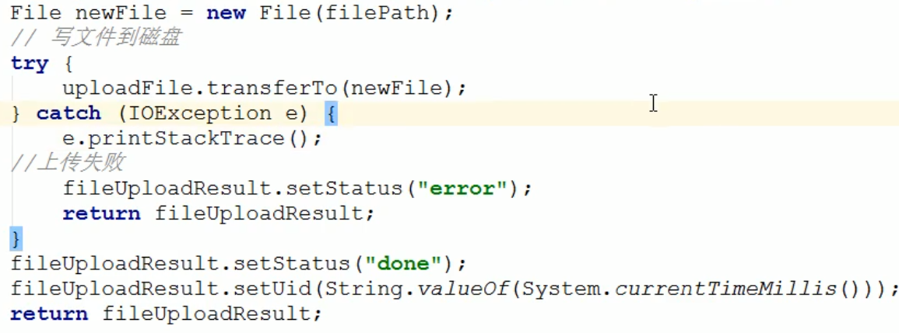
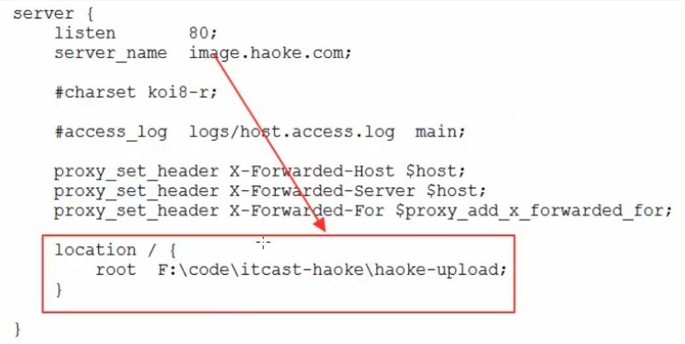

## 模块关系

### haoke-manage-api-server（**服务消费者**）（**需要依赖 dubbo-interface 工程**）(**供前端访问**)

- haoke.dubbo.api
  
  - config
    - `AliyunConfig` --- 图片上传
      - 往容器注入OSSClient用于图片上传，需要三个参数
    - `ClusterConfigurationProperties` --- Redis集群配置
    - `RedisClusterConfig` --- 注入Redis连接工厂和RedisTemplate
    - `WebConfig` --- 注入Redis缓存拦截器
  - controller
    - `WeiXinController` --- 
    - `HouseResourcesController` --- 房源管理控制器
      - 注入`HouseResourcesService`  
      - 请求路径："house/resources"
      - 返回值：ResponseEntity 
        - 继承了HttpEntity，可以添加HttpStatus状态码
    - `PicUploadController` --- 图片上传控制器
      - 请求路径："pic/uplaod"
      - 返回值：`PicUploadResult`
    - `GraphQLController` --- GraphQL控制器
      - 请求路径："graphql"
    - `SearchController` --- 搜索控制器
      - 请求路径："sear"
  - graphql
    - `GraphQlProvider` --- 将GraphQL对象载入Spring容器并初始化GraphQL对象
  
    - `MyDataFetcher`  --- 通用接口，定义的是创建GraphQL对象是需要的FileName和dataFetcher
  
    - `HouserResourcesDataFetcher`  --- `MyDataFetcher`接口实现类，根据id查询数据，定义查询名和获取数据
  
    - `HouserResourcesListDataFetcher`  --- `MyDataFetcher`接口实现类，查询房源列表
  
    - `MapHouseDataFetcher`  --- 实现`MyDataFetcher`接口，地图找房
  
  - interceptor
    - `RedisCacheInterceptor` --- Redis缓存拦截器
  
  - pojo
    - `MongoHouse`  --- 地图找房类
  
  - service**（spring的@service）**
    - `HouseResourcesService`  --- 房源管理业务逻辑
      - 注入@Reference(version = “”) `ApiHouseResourcesService`
    - `PicUploadService` --- 图片上传业务逻辑
      - 校验后缀名，上传阿里云
    - `MongoHouseService` --- 
    - `SearchService` 
    
  - vo
    - `PicUploadResult` --- 图片类
      - 根据AntDesign要求的格式返回（uid，name，status，response）
    - `PageInfo` --- 房源列表分页
      - 需要实现序列化接口
    - `TableResult<T>` 
    - `Pagination` 
    - `MapHouseDataResult` --- 结果集
    - `MapHouseXY`   --- 经纬坐标
    - `HouseData` --- 房源信息，对应mongodb中的集合
    - `SearchResult` --- 存储房源信息列表，分页信息

### haoke-manage-dubbo-server（**服务提供者**）(Dubbo服务)

- haoke-manage-dubbo-server-house-resources
  - haoke-manage-dubbo-server-house-resources-dubbo-interface（**对外提供的sdk包，pojo实体和接口，不提供实现类**）
    - haoke.dubbo.server
      - api
        - `ApiHouseResourcesService` --- 请求接口（Dubbo对外暴露的接口）
      - pojo
        - `BasePojo` --- 基础pojo，写的是通用属性（Created、Updated）
        - `HouseResource` --- 房源实体类，与数据库表对应
      - vo
        - `PageInfo` --- 分页查询返回的结果
  - haoke-manage-dubbo-server-house-resources-dubbo-service（**具体实现**）（**需要依赖dubbo-interface**）
    - haoke.dubbo.server
      - api**（dubbo的@Service(version = “”)** 
        - `ApiHouseResourcesServiceImpl` 
          - 实现 `ApiHouseResourcesService`
          - 注入spring中的`HouseResourcesService`
      - config
        - `MybatisConfig` --- 配置类
          - 加入分页插件(PaginationInterceptor)
      - mapper
        - `HouseResourcesMapper` 
          - 继承MybatisPlus提供的 `BaseMapper<HouseResources>`
      - service**（Spring的@service）**
        - `HouseResourcesService` --- 控制事务和逻辑
        - impl
          - `BaseServiceImpl<T extends BasePojo>`  --- 基础impl，通用的的crud操作
            - 注入BaseMapper<T> mapper 和对应的mapper关联
          - `HouseResourcesServiceImpl` 
            - 继承`BaseServiceImpl`<HouseResources> 
            - 实现 `HouseResourcesService`
            - 需要做一些校验

### itcast-haoke-im（微聊系统）

- controller
  - `MessageController` 

- pojo
  - `Message` --- 消息对象
  - `User` --- 用户对象
- dao
  - impl
    - `MessageDAOImpl` --- 实现类
  - `MessageDAO` --- 业务逻辑
- service
  - `MessageService` 

- websocket
  - `MessageHandler` extends TextWebSocketHandler
    - 处理接收发送消息的逻辑
  - `MessageHandshakeInterceptor` 
  - `WebSocketConfig` 

## 房源管理

### 新增房源

#### dubbo-interface开发（生产者）

1. ApiHouseResourcesService

   - ```java
     public interface ApiHouseResourcesService{
         //添加房源
         int saveHouseResources(HouseResources houseResources);
     }
     ```

#### dubbo-server开发（生产者）

1. BasePojo

   - ```java
     @Data
     public abstract class BasePojo implements Serializable{
         private Date created;
         private Date updated;
     } 
     ```

   - 在Dubbo中传输的对象都需要序列化，所有pojo类都要继承该类

2. HouseResourcesMapper

   - ```java
     public interface HouseResourcesMapper extends BaseMapper<HouseResources>{
        //他会继承Mybatis写好了的基础方法 
     }
     ```

3. 添加MybatisPlus配置类

   - ```java
     @MapperScan("")
     @Configuration
     public class MybatisConfig{
         
     }
     ```

4. 创建`HouseResourceService`

   - ```java
     //真正的逻辑实现接口
     public interface HouseResourceService{
         int saveHouseResources(HouseResources houseResources);
     }
     ```

5. 创建一个抽象的基础实现类`BaseServiceImpl`，实现一些通用的crud操作

   - ```java
     public abstract class BaseServiceImpl<T extends BasePojo>{
         @Autowired
         private BaseMapper<T> mapper;
         //常用的CRUD操作
     }
     ```

6. `HouseResourcesService`实现类

   - ```java
     public class HouseResourcesServiceImpl extends BaseServiceImpl implementsHouseResourcesService{
         @Override
         public int saveHouseResources(HouseResources houseResources){
             //校验,例如非空啥的
             return super.save(houseResources);
         }
     }
     ```

7. 对外暴露的api

   - ```java
     @Service(version = "1.0.0")
     public class ApiHouseResourcesServiceImpl implements ApiHouseResourcesService{
         @Autowired
         private HouseResourcesService houseResourcesService;
         
         @Override
         public int saveHouseResources (HouseResources houseResources){
             return this.houseResourcesService.saveHouseResources(houseResources);
         }
     }
     ```

8. 编写启动类

#### api-server开发（消费者）

1. 创建HouseResourcesService

   - ```java
     @Service
     public class HouseResourcesService{
         @Reference(version = "")
         private ApiHouseResourcesService apiHouseResourcesService;
         
         public boolean save(HouseResources houseResources){
             int result = this.apiHouseResourcesService.saveapiHouseResources(houseResources);
             return result == 1;
         }
     }
     ```

   - 用于调用dubbo服务

2. 编写Controller

   - ```java
     @Controller
     @RequestMapping("house/resources")
     public class HouseResourcesController{
         @PostMapping
         @responseBody
         public ResponseEntity<Void> save(@RequestBody HouseResources houseResources){
             try{
                 boolean bool  this.houseResourcesService.save(HouseResources);
                 if(bool){
                     return ResponseEntity.status(HttpStatus.CREATED).build();
                 }
             }catch(Exception e){
                 e.printStackTrace();
             }
             return ResponseEntity.status(HttpStatus.INTERNAL_SERVER_ERROR).build();
         }
     }
     ```
     

3. 编写启动类
   - 前端使用umi提供的反向代理解决跨域问题

### 房源列表

#### dubbo-interface开发（生产者）

1. ApiHouseResourcesService

   - ```java
     public interface ApiHouseResourcesService{
         //添加房源
         int saveHouseResources(HouseResources houseResources);
         //分页查询房源列表
         PageInfo<HouseResources> queryHouseResourcesList(int page, int pageSize, HouseResources queryCondition);
     }
     ```

2. 在vo下定义一个PageInfo类作为返回值

   - ```java
     @Data
     @AllArgsConstructor
     public class PageInfo<T> implements Serializable{
         private static final long serialVersionUID = .... ; //序列化id
         private Integer total;
         private Integer pageNum;
         private Integer pageSize;
         private List<T> records  = Collections.emptyList();
     }
     ```

#### dubbo-server开发（生产者）

- ApiHouseResourcesServiceImpl中调用HouseResourcesService中的方法

  - ```java
    @Service(version = "1.0.0")
    public class ApiHouseResourcesServiceImpl implements ApiHouseResourcesService{
        @Autowired
        private HouseResourcesService houseResourcesService;
        
        @Override
        public int saveHouseResources (HouseResources houseResources){...}
        
        @Override
        public PageInfo<HouseResources> queryHouseResourcesList(int page, int pageSize, HouseResources queryCondition){
            return this.houseResourcesService.queryHouseResourcesList(page, pageSize, queryCondition);
        }
    }
    ```

- 在HouseResourcesService中创建queryHouseResourcesList()

  - ```java
    public interface HouseResourceService{
        int saveHouseResources(HouseResources houseResources);
        //分页查询
        PageInfo<HouseResources> queryHouseResourcesList(int page, int pageSize, HouseResources queryCondition);
    }
    ```

- 在HouseResourcesServiceImpl中实现方法

  - ```java
    public class HouseResourcesServiceImpl extends BaseServiceImpl implementsHouseResourcesService{
    	@Override
        public int saveHouseResources(HouseResources houseResources){...}
        
        @Override
        public PageInfo<HouseResources> queryHouseResourcesList(int page, int pageSize, HouseResources queryCondition){
            QueryWrapper qw = new QueryWrapper();
            qw.orderByDesc("update");
            IPage iPage = super.queryPageList(qw, page, pageSize);
    
            return new PageInfo<HouseResources>(
                Long.valueOf(iPage.getTotal()).intValue(),
                page, pageSize, 
                ipage.getRecords()
            );
        }
    }
    ```

- 由于在BaseServiceImpl中MybatiesPlus实现的方法不满足需求使用，所以要自定义方法

  - ```java
    public abstract class BaseServiceImpl<T extends BasePojo>{
        @Autowired
        private BaseMapper<T> mapper;
        //常用的CRUD操作   
        
        //新增查询方法
        public IPage<T> queryPageList(QueryWrapper<T> queryWrapper, Integer page, Integer rows){
            //获取分页数据
            return this.mapper.selectPage(new Page<T>(page, rows).queryWrapper);
        }
    }
    ```

#### api-server开发（消费者）

1. `HouseResourceController`创建方法

     - ```java
       @Controller
       @RequestMapping("house/resources")
       public class HouseResourcesController{
           @Autowired
           private HouseResourcesService houseResourcesService;
           
           //新增房源
           @PostMapping
           @responseBody
           public ResponseEntity<Void> save(@RequestBody HouseResources houseResources){...}
           
           //查询房源列表
           @GetMapping
           @responseBody
           public ResponseEntity<TableResult> list(@RequestBody HouseResources houseResources, 
                                            @RequestParam(name = "currentPage", defaultValue = "1") Integer currentPage,
                                            @RequestParam(name = "pageSize", defaultValue = "10") Integer pageSize){
               return ResponseEntity.ok(this.houseResourcesService.queryList(houseResources, currentPage, pageSize));
           }
       }
       ```


2. 创建`TableResult` 类

     - ```java
       @Data
       @AllArgsConstructor
       public class Pagination{
           //数据列表
        	private List<T> list; 
           //分页信息
           private Pagination pagination;
       }
       ```


3. 创建`Pagination` 类

     - ```java
       @Data
       @AllArgsConstructor
       public class Pagination{
           private Integer current;
           private Integer pageSize; 
           private Integer total;
       }
       ```


4. 在`HouseResourcesService` 中创建queryList() 方法

     - ```java
       @Service
       public class HouseResourcesService{
           @Reference(version = "")
           private ApiHouseResourcesService apiHouseResourcesService;
           
           public boolean save(HouseResources houseResources){...}
           
           public TableResult<HouseResources> queryList(HouseResources hr, Integer currentPage, Integer pageSize){
           	PageInfo<HouseResources> pageInfo = this.apiHouseResourcesService.queryHouseResourcesList(currentPage, pageSize, hr); 
               return new TableResult<>(PageInfo.getRecords(),new Pagination(currentPage, pageSize, PageInfo.getTotal()));
       	}
       }
       ```


##### 使用GraphQL

1. 修改`haoke.graphqls` 

   - ```yaml
     schema{
     	query: HaokeQuery
     }
     type HaokeQuery{
     	#根据id查询数据
     	HouseResources(id:Long) : HouseResources
     	#分页查询房源列表
     	HouseResourcesList(pageL:Int, pageSize:Int) : TableResult
     }
     type HouseResources{
     	//各种属性
     }
     type TableResult{
     	list: [HouseResources]
     	pagination: Pagination
     }
     type Pagination{
     	current: Int
     	pageSize: Int
     	total: Int
     }
     ```

2. 创建`HouserResourcesListDataFetcher`

   - ```java
     @Component
     public class HouserResourcesListDataFetcher implements MyDataFetcher{
         @Autowired
         private HouseResourcesService houseResourcesService;
         
         @Override
         public String fieldName(){
             return "HouseResourcesList";
         }
         
         //通过id查询数据
         @Override
         public Object dataFetcher(DataFetchingEnviroment enviroment){
             Integer page = enviroment.getArgument("page");
             if(null == page) page = 1;
             Integer pageSize = enviroment.getArgument("pageSize");
             if(null == pageSize) pageSize = 5;
             return this.houseResourcesService.queryList(null, page, pageSize);
         }
     }
     ```

### 根据id查询房源

#### dubb0-interface开发（生产者）

- 在`ApiHouseResourcesService` 中定义方法

  - ```java
    public interface ApiHouseResourcesService{
        //添加房源
        int saveHouseResources(HouseResources houseResources);
        //分页查询房源列表
        PageInfo<HouseResources> queryHouseResourcesList(int page, int pageSize, HouseResources queryCondition);
        //根据id查询房源
        HouseResources queryHouseResourcesById(Long id);
    }
    ```

#### dubbo-server开发（生产者）

- 在`ApiHouseResourcesServiceImpl` 中调用service层实现

  - ```java
    @Service(version = "1.0.0")
    public class ApiHouseResourcesServiceImpl implements ApiHouseResourcesService{
        @Autowired
        private HouseResourcesService houseResourcesService;
        
        @Override
        public int saveHouseResources (HouseResources houseResources){...}
        
        @Override
        public PageInfo<HouseResources> queryHouseResourcesList(int page, int pageSize, HouseResources queryCondition){...}
        
        @Override
        public HouseResources queryHouseResourcesById(Long id){
            return this.houseResourcesService.queryHouseResourcesById(id);
        }
    }
    ```

- 在`HouseResourcesService` 中定义方法

  - ```java
    public interface HouseResourceService{
        int saveHouseResources(HouseResources houseResources);
        //分页查询
        PageInfo<HouseResources> queryHouseResourcesList(int page, int pageSize, HouseResources queryCondition);
        //根据id查询房源
        HouseResources queryHouseResourcesById(Long id);
    }
    ```

- 在`HouseResourcesServiceImpl`中调用`BaseServiceImpl` 中的方法实现

  - ```java
    public class HouseResourcesServiceImpl extends BaseServiceImpl<HouseResources> implementsHouseResourcesService{
    	@Override
        public int saveHouseResources(HouseResources houseResources){...}
        
        @Override
        public PageInfo<HouseResources> queryHouseResourcesList(int page, int pageSize, HouseResources queryCondition){...}
        
        @Override
        public HouseResources queryHouseResourcesById(Long id){
            return super.queryById(id);
        }
    }
    ```

#### api-server开发（消费者）（GraphQL开发）

1. 创建`haoke.graphqls` 文件

   - ```yaml
     schema{
     	query: HaokeQuery
     }
     type HaokeQuery{
     	HouseResources(id:Long) : HouseResources
     }
     type HouseResources{
     	//各种属性
     }
     ```
2. 创建`GraphQLController`

     - ```java
       @RequestMapping("graphql")
       @Controller
       public class GraphQLController{
           @Autowired
           private GraphQL graphQL;
           
           @GetMapping
           @ResponseBody
           public Map<String, Object> query(@RequestParam("query") String query){						
               return this.graphQL.execute(query).toSpecification();//标准输出，返回的时Map类型
           }
       }
       ```


3. 创建`GraphQLProvider` 

     - ```java
       @Component
       public class GraphQLProvide{
           private GraphQL graphQL;
           
           //api下的service，如果使用MyDataFetcher的话可以不用注入
           @Autowired
           private HouseResourcesService houseResourcesService;
           
           //MyDataFetcher实现类的集合
           @Autowired
           private List<MyDataFetcher> myDataFetchers;
           
           //初始化GraphQL对象
           @PostConstruct//在Spring初始化时执行
           public void init() throws FileNotFoundException{
               //读取外部GraphQL文件并解析
               File file = ResourceUtils.getFile("classpath:haoke.graphqls");
               this.graphQL = GraphQL.newGraphQL(buildGraphQLSchema(file)).build();
           }
           
           //构建GraphQLSchema
           private GraphQLSchema buildGraphQLSchema(File file){
               TypeDefinitionRegistry typeRegistry = new SchemaParser().parse(file);
               return new SchemaGenerator().makeExecutableSchema(typeRegistry, buildWiring());
           }  
           
           //构建RuntimeWiring
           private RuntimeWiring buildWiring(){
               return RuntimeWiring.newRuntimeWiring().type("HaokeQuery", builder -> {
                   builder.dataFetcher("HouseResources", enviroment -> {
                       	Long id = envirom.getent.getArgument("id");
                       	return this.houseResourcesService.queryHouseResourcesById(id);
                       )}
               ).build();
           }
           
           //构建RuntimeWiring 优化
           private RuntimeWiring buildWiring(){
               return RuntimeWiring.newRuntimeWiring().type("HaokeQuery", builder -> {
                   for(MyDataFetcher myDataFetcher : myDataFetchers){
                       builder.dataFetcher(myDataFetcher.fieldName(), enviroment -> myDataFetcher.dataFetcher(enviroment));
                   }
                   return builder;
               }).build();
           }
                                                            
           @Bean
           public GraphQL graphQL(){
               return this.graphQL;
           }
       }
       ```


4. 改进RuntimeWiring方法

   1. 创建`MyDataFetcher`接口

     - ```java
       public interface MyDataFetcher{
           //GraphQL查询的名称
           String fieldName();
           //通过id查询数据
           Object dataFetcher(DataFetchingEnviroment enviroment);
       }
       ```

   2. 创建`MyDataFetcher` 的实现类 `HouserResourcesDataFetcher` 

     - ```java
       @Component
       public class HouseResourcesDataFetcher implements MyDataFetcher{
           @Autowired
           private HouseResourcesService houseResourcesService;
           
           @Override
           public String fieldName(){
               return "HouseResources";
           }
           
           //通过id查询数据
           @Override
           public Object dataFetcher(DataFetchingEnviroment enviroment){
               Long id = enviroment.getArgument("id");
               return this.houseResourcesService.queryHouseResourcesById(id);
           }
       }
       ```

   3. `HouseResourcesService` 添加queryHouseResourcesById() 方法

     - ```java
       @Service
       public class HouseResourcesService{
           @Reference(version = "")
           private ApiHouseResourcesService apiHouseResourcesService;
           
           public boolean save(HouseResources houseResources){...}
           
           public TableResult<HouseResources> queryList(HouseResources hr, Integer currentPage, Integer pageSize){...}
           //根据id查询数据
           public HouseResources queryHouseResourcesById(Long id){
               return this.apiHouseResourcesService.queryHouseResourcesById(id);
           }
       }
       ```


### 房源更新

#### dubbo-interface开发（生产者）

- 在`ApiHouseResourcesService` 中添加updateHouseResources()方法

  - ```java
    public interface ApiHouseResourcesService{
        //添加房源
        int saveHouseResources(HouseResources houseResources);
        //分页查询房源列表
        PageInfo<HouseResources> queryHouseResourcesList(int page, int pageSize, HouseResources queryCondition);
        //根据id查询房源
        HouseResources queryHouseResourcesById(Long id);
        //更新
        boolean updateHouseResources(HouseResources houseResources);
    }
    ```

#### dubbo-server开发（生产者）

- 在`ApiHouseResourcesServiceImpl` 中添加updateHouseResources()方法
  
  - ```java
    @Service(version = "1.0.0")
    public class ApiHouseResourcesServiceImpl implements ApiHouseResourcesService{
        @Autowired
        private HouseResourcesService houseResourcesService;
        @Override
        public int saveHouseResources (HouseResources houseResources){...}
        @Override
        public PageInfo<HouseResources> queryHouseResourcesList(int page, int pageSize, HouseResources queryCondition){...}
        @Override
        public HouseResources queryHouseResourcesById(Long id){...}
        //更新房源
        @Override
        public boolean updateHouseResources(HouseResources houseResources){
            return this.houseResourcesService.updateHouseResources(houseResources);
        }
    }
    
    ```
  
- 在`HouseResourcesService`中添加updateHouseResources()方法

  - ```java
    public interface HouseResourceService{
        int saveHouseResources(HouseResources houseResources);
        //分页查询
        PageInfo<HouseResources> queryHouseResourcesList(int page, int pageSize, HouseResources queryCondition);
        //根据id查询房源
        HouseResources queryHouseResourcesById(Long id);
        //更新
        boolean updateHouseResources(HouseResources houseResources);
    }
    ```

- 在`HouseResourcesServiceImpl`中实现updateHouseResources()方法

  - ```java
    public class HouseResourcesServiceImpl extends BaseServiceImpl<HouseResources> implementsHouseResourcesService{
    	@Override
        public int saveHouseResources(HouseResources houseResources){...}
        
        @Override
        public PageInfo<HouseResources> queryHouseResourcesList(int page, int pageSize, HouseResources queryCondition){...}
        
        @Override
        public HouseResources queryHouseResourcesById(Long id){...}
        
        @Override
        public boolean updateHouseResources(HouseResources houseResources){
            return super.update(houseResources) == 1;
        }   
    }
    ```


#### api-server开发（消费者）

- 在`HouseResourcesController`中添加update()方法
  
  - ```java
    @Controller
    @RequestMapping("house/resources")
    public class HouseResourcesController{
        @Autowired
        private HouseResourcesService houseResourcesService;
        //新增房源
        @PostMapping
        @responseBody
        public ResponseEntity<Void> save(@RequestBody HouseResources houseResources){...}
        //查询房源列表
        @GetMapping
        @responseBody
        public ResponseEntity<TableResult> list(...) Integer pageSize){...}
        
        //修改房源信息
        publlllc ResponseEntity<Void> update(@RequestBody HouseResources houseResources){
            try{
                boolean bool = this.houseResourcesService.update(houseResources);
                if(bool) return ResponseEntity.status(HttpStatus.NO_CONTENT).build();
            }catch (Exection e){
                e.printStackTrace();
            }
            return ResponseEntity.status(HttpStatus.INTERNAL_SERVER_ERROR).build(); 
        }
    }
    ```
  
- 在`HouseResourcesService` 中添加updateHouseResources()方法

  - ```java
    @Service
    public class HouseResourcesService{
        @Reference(version = "")
        private ApiHouseResourcesService apiHouseResourcesService;
        
        public boolean save(HouseResources houseResources){...}
        
        public TableResult<HouseResources> queryList(HouseResources hr, Integer currentPage, Integer pageSize){...}
        //根据id查询数据
        public HouseResources queryHouseResourcesById(Long id){...}
        
        public boolean update(HouseResources houseResources){
            return this.apiHouseResourcesService.updateHouseResources(houseResources);
        }
    }
    ```


## 图片存储

### 阿里云OSS（对象存储）服务

1. 在api-server中实现

2. 创建aliyun.properties 文件存储信息

3. 创建配置文件，将**OSSClient**加入Spring容器

   - ```java
     @Configuration
     @PropertySource("classpath:aliyun.properties")
     @ConfigurationProperties(prefix = "aliyun")
     @Data
     public class AliyunConfig{
         private String endpoingt;
         private String accessKeyId;
         private String accessKeySecret;
         private String bucketName;
         private String urlPrefix;
         
         @Bean
         public OSSClient() oSSClient(){
             return new OSSClient(endpoingt, accessKeyId, accessKeySecret);
         }
     }
     ```

5. 创建一个图片类用于上传，根据AntDesign定义的格式

   - ```java
     @Data
     public class PicUploadResult{
         private String uid;
         private String name;
         private String status;
         private String response;
     }
     ```

6. 创建图片上传控制器

   - ```java
     @RequestMapping("pic/upload")
     @controller
     public class PicUploadController{
         @Autowired
         private PicUploadService picUploadService;
         
         @PostMapping
         @ResponseBody
         public PicUploadResult upload(@RequetParam("file") MultpartFile file){
             return this.picUploadService.upload(file);
         }
     }
     ```

7. 创建图片上传业务类`PicUploadService`，实现上传逻辑 

     - 配置文件 aliyun.properties
       - 
       
   - 图片校验和上传具体实现
   
     - ```java
       @Service
       public class PicUploadService {
           private static final String[] TYPE = new String[]{".bmp",".jpg",".jpeg",".gif",".png",}
           public PicUploadResult  upload(MultpartFile uploadFile){
               @Autowired
               private OssClient ossClient;
               @Autowired
               private AliyunConfig aliyunConfig;
               
               PicUploadResult file = new PicUploadResult();
               boolean isLegal = false;
               
               //判断文件后缀名是否正确
               for(String type : TYPE){
                   if(StringUtils.endWithIgnoreCase(uploadFile.getOriginalFilename(), type)){
                       isLegal = rue;
                       break;
                   }
               }
               if(!isLegal){
                   file.setStatus("error");
                   return file;
               }
               //上传到阿里云
               
               //文件新路径
               String fileName = uploadFile.getOriginalFilename();
               String filePath = getFilePath(fileName);
               try{
                   ossClient.putObject(aliyunConfig.getBucketName(), filePath, new ByteArrayInputStream(uploadFile.getBytes()));
               }catch(Exection e){
                   e.printStackTrace();
                   //上传失败
                   file.setStatus("error");
                   return file;
               }
               //上传成功
               file.setStatus("done");
               file.setName(this.aliyunConfig.getUrlPrefix() + filePath);
               file.setUid(Stirng.valueOf(System.currentTimeMillis()));
               return file;
           }
           //取得文件路径
           private String getFilePath(String sourceFileName){
               DateTime dateTime = new DateTime();
               return "images/" + dateTime.toString("yyyy") + "/" + dateTime.toString("MM") + "/" + dateTime.toString("dd") + "/"
                   + System.currentTimeMilllis() + RandomUtils.nextInt(100, 9999) + "."
                   + StringUtiles.substringAfterLast(sourceFileName, ".");
           }
       }
       ```

### 存储到本地

- 在api-server中实现
- 创建`PicLoadFileSystemService` 
  - 校验图片格式，生成存储地址（本地机器地址），网络访问需要ajax映射，或者搭建nginx进行访问
  - 

- 搭建Nginx进行网络访问图片

  - 

  - 修改本机host映射

## 微聊系统（外部项目）

处理消息（增删改查，创建对象）- 编写WebSocket（发送 / 接收消息）- 

### 处理消息

- `Message`类
  
  - ```java
    @Data
    @AllArgsConstruceor
    @NoArgsConstructor
    @Document(collection = "message") //指定
    @Builder //转变为建造者模式，链式构建对象
    public class Message{
        @Id 		//主键
        private ObjectId id;
        private String msg;
        @Indexed 	//需要建立索引
        private Integer status; 	// 1-未读  2-已读
        @Field("send_date")
        @Indexe		//需要建立索引
        private Date sendDate;
        @Field("read_date")
        private Date readDate;
        @Indexed 	//需要建立索引
        private User from;
        @Indexed 	//需要建立索引
        private User to;  
    }
    ```
  
- 创建`User`类

  - ```java
    @Data
    @AllArgsConstruceor
    @NoArgsConstructor
    @Builder //转变为建造者模式，链式调用
    public class User{
        private Long id;
        private String username;
    }
    ```

- 创建`MessageDAO` 接口，定义业务方法
  
  - ```java
    public interface MessageDAO{
        //查询点对点的聊天记录
        List<Message> findListByFromAndTo(Long fromId, Long toId, Integer page, Integer rows);
        //根据id查询数据
        Message findMessageById(String id);
        //更新消息状态
        UpdateResult updateMessageState(ObjectId id, Integer status);
        //新增消息，保存到mongodb
        Message saveMessage(Message message);
        //根据消息id删除数据
        DeleteResult deleteMessage(String id);
    }
    ```
  
- 创建`MessageDaoImpl` 实现类

  - ```java
    @Component
    public class MessageDaoImpl implements MessageDAO {
        @Autowired
        private MongoTemplate mongoTemplate;
        
        //查询点对点的聊天记录
        public List<Message> findListByFromAndTo(Long fromId, Long toId, Integer page, Integer rows){
            //设置查询条件
            //用户A发送给用户B的条件
            Criteria criteriaFrom = new Criteria().andOperator(
            	Criteria.where("from.id").id(fromId),.
                Criteria.where("to.id").id(toId)
            );
            //用户B发送给用户A的条件
            Criteria criteriaTo = new Criteria().andOperator(
            	Criteria.where("from.id").id(toId),
                Criteria.where("to.id").id(fromId)
            );
            //创建查询条件对象
            Criteria criteria = new Criteria().orOperator(criteriaFrom, criteriaTo);
            
            //设置分页
            PageRequest pageRequest = PageRequest.of(page - 1, pageSize, Sort.by(Sort.Direction.ASC, "send_data"));
            
            //设置查询条件， 分页
            Query query = Query.query(criteria).with(pageRequest);
            
            //需要查询语句和对象
            return this.mongoTemplate.find(query, Message.class);
        }
        //根据id查询数据
        public Message findMessageById(String id){
            return this.mongoTemplate.findById(new ObjectId(id), Message.class);
        }
        //更新消息状态
        public UpdateResult updateMessageState(ObjectId id, Integer status){
            Query query = Query.query(Criteria.where("id").is(id));
            Update update = Update.update("status", status);
            if(status.intValue() == 1) update.set("send_date", new Date());
            if(status.intValue() == 2) update.set("read_date", new Date());
            return this.mongoTemplate.updateFirst(query, update,  Message.class);
        }
        //新增消息，保存到mongodb
        public Message saveMessage(Message message){
            //需要写入发送时间，设置状态为1-未读
            message.setSendDate(new Date());
            message.setStatus(1);
            message.setId(ObjectId.get());
            return this.mongoTemplate.save(message);
        }
        //根据消息id删除数据
        public DeleteResult deleteMessage(String id){
            Query query = Query.query(Criteria.where("id").is(id));
            return this.mongoTemplate.remove(query, Message.class);
        }
    }
    ```

### 编写WebSocket

`MessageHandler`  发送 / 接收消息处理

- ```java
  @Component
  @RocketMQMessageListener(
      topic = "",				  //topic
      selectorExpression = "",   //tag
      messageModel =  ,		  //消息模式：广播 / 集群
      consumerGroup = "" 		  //消费者组
  )
  public class MessageHandler extends TextWebSocketHandler implements RocketMQListener<String>{
      //消息的增删改查
      @Autowired
      private MessageDAO messageDAO;
      @Autowired
      private RocketMQTemplate rocketMQTemplate;
      
      //格式转换
      private static final ObjectMapper MAPPER = new ObjectMapper();
      //收集用户session对象，用于判断用户是否在线
      private static final Map<Long, WebSocketSession> SESSION = new HashMap<>();
      
      //建立连接后要做的事情
      @Override
      public void afterConnectionEstablished(WebSocketSession session) throws Exection{
          //用户建立连接后将用户Session收集
          Long id = (Long) session.getAttributes().get("uid"); //需要设置拦截器获取
          SESSION.put(id, session);
      }
      
      //发送消息
      @Override
      protected void handleTextMessage(WebSocketSession session, TextMessage textMessage) throws Exception{
          Long uid = (Long) session.getAttributes().get("uid");
          JsonNode jsonNode = MAPPER.readTree(textMessage.getPayload());
          Long toId = jsonNode.get("toId").asLong();
          String msg = jsonNode.get("msg").asText();
          Message message = Message.builder()
              .from(UserData.USER_MAP.get(uid))
              .to(UserData.USER_MAP.get(toId))
              .msg(msg)
              .build();
          //将消息保存到mongodb
          message = this.messageDAO.saveMessage(message);
          
          //判断目标用户是否在线
          WebSocketSession toSession = SESSIONS.get(toId);
          if(toId != null && toSession.isOpen()){
              toSession.sendMessage(new TextMessage(MAPPER.writeValueAsString(message)));
              //将消息更新为已读
              this.messageDAO.updateMessageState(message.getId(), 2);
          }
          //分布式WebSocket
          else{
              //用户可能在其他节点中，先将消息发送到MQ中
              //需要添加tag便于消费者筛选
              this.rocketMQTemplate.convertAndSend(topic:tag, 序列化后的消息);
          }
      }
      //消费消息
      @Override
      public void onMessage(String msg) throws Exception{
          JsonNode jsonNode = MAPPER.readTree(msg);
          long toId = jsonNode.get("to").get("id").longValue();
          //判断to用户是否在线
          WebSocketSession toSession = SESSION.get(toId);
          if(toId != null && toSession.isOpen()){
              toSession.sendMessage(new TextMessage(msg));
              this.messageDAO.updateMessageState(new ObjectId(jsonNode.get("id").asText), 2);
          }
      }
  }
  ```

`MessageHandshakeInterceptor` 拦截器，用于获取用户id

- ```java
  @Component
  public class MessageHandshakeInterceptor implements HandshakeInterceptor{
      //在客户端与服务端建立连接之前执行，握手之前
      @Override
      public boolean beforeHandshake(ServerHttpRequest request, ServerHttpResponse response, WebSocketHandler wsHandler, Map<String, Object> attributes) throws Exception{
          String path = request.getURI().getPath();
          String[] ss = StringUtils.split(path, '/');
          if(ss.length != 2) return false;
          if(!StringUtils.isNumeric(ss[1])) return false;
          attributes.put("uid", Long.valueOf(ss[1]));
          return true;
      }
  }
  ```

`WebSOcketConfig` 添加拦截器

- ```java
  @Configuration
  @EnableWebSocket
  public class WebSocketConfig implements WebSocketConfigurer{
      @Autowired
      private MessageHandler messageHandler;
      @Autowired
      private MessageHandshakeInterceptor messageHandshakeInterceptor;
      
      @Override
      public void registerWebSocketHandlers(WebSocketHandlerRegistry registry){
          registry.addHandler(this.messageHandler, "/ws/{uid}")
              .setAllowedOrigins("*") //设置跨域请求
              .addInterceptors(this.messageHandshakeInterceptor);
      }
  }
  ```

### 查询历史信息，其实就是查询消息列表

- 创建`MessageController`
  
  - ```java
    @RequestMapping("message")
    @CrossOrigin //跨域
    public class MessageController {
        @autowired
        private MessageService messageService;
        
    	@GetMapping
        public List<Message> queryMessageList(
        	@RequestParam("fromId") Long fromId,
        	@RequestParam("toId") Long toId,
       		@RequestParam(value = "page", default = "1") Integer page,
        	@RequestParam(value = "rows", default = "10" Integer rows){
    	return this.messageService.queryMessageList(fromId, toId, page, rows);
    }
    ```
  
- 创建`MessageService` 
  
  - ```java
    @Service
    public class MessageService{
        @Autowired
        private MessageDAO messageDAO;
        
        public List<Message> queryMessageList(Long fromId, Long toId, Integer page, Integer rows){
            List<Message> list = this.messageDAO.findListByFromAndTo(fromId, toId, page, rows);
            //设置消息状态为已读
            for(Message message : list){
                if(message.getStatus().intValue() == 1){
                    this.messageDAO.updateMessageState(message.getId(), 2);
                }
            }
            return list;
        }
    }
    ```
  
- 创建`UserController`
  
  - ```java
    @RestController
    @CrossOrigin
    @RequestMapping("user")
    public class UserController{
        @Autowired
        private MessageService messageService;
        
        @GetMapping
        public List<Map<String, Object>> queryUserList(@RequestParam("fromId") Long fromId){
            List<Map<String, Object>> result = new ArrayList<>();
            for(Map.Entry<Long, User> userEntry : UserData.USER_MAP.entrySet()){
                Map<String,Object> map = new HashMap<>()
                //获得对应的值
                result.add(map);
            }
            return result;
        }
    }
    ```
  

## 地图找房

- GraphQL中添加地图房源数据

  - ```yaml
    schema{
    	query: HaokeQuery
    }
    type HaokeQuery{
    	#根据id查询数据
    	HouseResources(id:Long): HouseResources
    	#分页查询房源列表
    	HouseResourcesList(pageL:Int, pageSize:Int): TableResult
    	#地图房源数据
    	MapHouseData(lng:Float, lat:Float, zoom:Int): MapHouseDataResult
    }
    type HouseResources{...}
    type TableResult{...}
    type Pagination{...}
    
    type MapHouseDataResult{
    	list: [MapHouseXY]
    }
    type MapHouseXY{
    	x: Float
    	y: Float
    }
    ```

- 创建`MapHouseDataResult` 和 `MapHouseXY`

  - ```java
    @Data
    @AllArgsConstructor
    @NoArgsConstructor
    public class MapHouseDataResult{
        private List<MapHouseXY> list;
    }
    ```

  - ```java
    @Data
    @AllArgsConstructor
    @NoArgsConstructor
    public class MapHouseXY{
        private Float x;
        private Float y;
    }
    ```

- 创建`MongoHouse` 类，对应MongoDB中的表

  
  - ```java
    @Data
    @AllArgsConstructor
    @NoArgsConstructor
    @Document(collection = "house")
    @Builder
    public class MongoHouse{
        @Id
        @JsonSerialize(using = ToStringSerializer.class)
        private ObjectId id;
        private Long hid;
        private String title;
        private Float[] loc;
    }
    ```
    
  


- 创建`MongoHouseService`

  - ```java
    @Service
    public class MongoHouseService{
        //需要定义缩放比对应的公里数
        public static final Map<Integer, Double> BAIDU_ZOOM = new HashMap<>();
        @Autowired
        private MongoTemplate mongoTemplate;
        
        public MapHouseDataResult queryHouseData(Float lng, Float lat, Integer zoom){
            //1.5倍距离范围
            double distance = BAIDU_ZOOM.get(zoom) * 1.5 / 111.12;
            
            Query query = Query.query(Criteria.where("loc").near(new Point(lng, lat)).maxDistance(distance));
            List<MongoHouse> mongoHouses = this.mongoTemplate.find(query, MongoHouse.class);
            List<MapHouseXY> list = new ArrayList<>();
            for(MongoHouse mongoHouse : mongoHouses){
                list.add(new MapHouseXY(mongoHouses.getLoc()[0], mongoHouse.getLoc()[1]));
            }
            return new MapHouseDataResult(list);
        }
    }
    ```

- 在Mongodb中创建地理位置索引

  - ```yaml
    //2d就是平面地理位置索引
    db.house.createIndex({loc:'2d'})
    {
    	"createdCollectionAutomatically" : true,
    	"numIndexesBefore" : 1,
    	"numIndexesAfter" : 2.
    	"ok" : 1
    }
    ```

- 为house表中的hid创建唯一索引

  - `db.house.createIndex({hid:1},{unique:true})`

- 查询时使用$near查询，一度是111.12Km

  - db.house.find({loc:{**\$near**:[X, Y], **\$maxDistance**:附近公里数/111.12}})

- 创建`MapHouseDataFetch`

  - ```java
    @Component
    public class MapHouseDataFetcher implements MyDataFetcher 
        @Autowired
        private MongoHouseService mongoHouseService;
        @Override
        public String fieldName(){
            return "MapHouseData";
        }
        @Override
        public Object dataFetch(DataFetchingEnviroment enviroment){
            List<MapHouseXY> list = new ArrayList<>();
            Float lng = ((Double) enviroment.getArgument("lng")).floatValue();
            Float lat = ((Double) enviroment.getArgument("lat")).floatValue();
            Integer zoom = enviroment.getArgument("zoom");
            
            return mongoHouseService.queryHouseData(lng, lat, zoom);
        }
    }
    ```

## 搜索功能

### 服务消费者

- 创建`HouseData` 映射查询
  
  - ```java
    @Data
    @AllArgsConstructor
    @NoArgsConstructor
    @Document(indexName = "haoke", type = "house", createIndex = false)
    public class HouseData{
        @Id
        private String id;
        private String titile;
        private String rent;
        private String floor;
        private String image;
        private String orientation;
        private String houseType;
        private String rentMethod;
        private String time;
    }
    ```
  
- 创建`SearchResult` 

  - ```java
    @Data
    @AllArgsConstructor
    @NoArgsConstructor
    public class SearchResult{
        private Integer totalPage;
        private List<HouseData> list;
    }
    ```

- 创建`SearchController`

  - ```java
    public class SearchController{
        @Autowired
        private SearchService searchService;
        
        @GetMapping
        public SearchResult search(@RequestParam("keyWord") String kewWord,
                                   @RequestParam(value = "page", defaultValue = "1") Integer page){
            if(page > 100)  page = 1;
            return this.searchService.search(keyWord, page);
        }
    }
    ```

- 创建`SearchService`，实现高亮显示
  
  - ```java
    public class SearchService{
        @Autowired
        private ElasticsearchTemplate elasticsearchTemplate;
        //由后端指定页面数据条数
        public static final Integer ROWS = 10;
        
        public SearchResult serach(){
            //设置分页参数
            PageRequest pageRequest = PageRequest.of(page - 1, ROWS);
            SearchQuery searchQuery = new NativSearchQueryBuilder()
                .withQuery(Querybuilder.matchQuery("title", keyWord).operator(Operator.AND))
                .withPageable(pageRequest)
                .withHighlightFields(new HighlightBuilder.Field("title"))
                .builder();
            AggregatedPage<HouseData> housePage = 
                this.elasticsearchTemplate.queryForPage(searchQuery, HouseData.class, 
                                                        //处理高亮字段和非高亮字段！！！
                                                        new SearchResultMapper(){
                @Override
                public <T> AggregatedPage<T> mapResults(SearchResponse response, Class<T> clazz, Pageable pageable) throws Exception{
                    if(response.getHits().totalHits == 0) return new AggregatedPageImpl<>(Collection.emptyList(), pageable, 0L);
                    List<T> list = new ArrayList<>();
                    for(SearchHits searchHit : response.getHits().getHits()){
                        T obj = (T) ReflectUtils.newInstance(clazz);
                        FieldUtils.writeField(obj, "id", searchHit.getId(), true);
                        
                        //非高亮字段的数据处理
                        for(Map.Entry<String, Object> entry : searchHit.getSourceAsMap().entrySet()){
                            if(null == FieldUtils.getFiled(clazz, entry.getKey(), true)) continue;
                            FieldUtils.writeField(obj, entry.getKey(), entry.getValue(), true);
                        }
                        //处理高亮字段
                        for(Map.Entry<String, HighlighField> entry : searchHit.getHighlighFields().entrySet()){
                            StringBulider sb = new StringBuilder();
                            Text[] fragments = entry.getValue().getFragments();
                            for(Text fragment : fragments){
                                sb.append(fragment.toString());
                            }
                            FieldUtils.writeField(obj, entry.getKey(), sb.toString(), true);
                        }
                        list.add(obj);
                    }
                    return new AggregatedPageImpl<>(list, pagable, response.getHits().totalHits);
                }                                                                 
            });
            return new SearchResult(housePage.getTotalPages(), housePage.getContent());
        }
    }
    ```
  

### 热词搜索

- redis使用sortedSet

- `SearchController` 添加方法，并添加热词搜索次数

  - ```java
    public class SearchController{
        @Autowired
        private SearchService searchService;
        @Autowired
        private RedisTemplate redisTemplate;
        
        @GetMapping
        public SearchResult search(){
            if(page > 100)  page = 1;
            SearchResult search = this.searchService.search(keyWord, page);
            
            //热词加入redis
            String redisKey = "SEARCH_HOT_WORDS";
            int count = ((Math.max(search.getTotalPage(), 1) - 1) * searchService.ROWS) + search.getList().size();
            this.redisTemplate.opsForZSet().add(redisKey, keyWord, count);
            //判断是否返回热词搜索
            if(search.totalPage() <=1)[
                Set set = this.redisTemplate.opsForZSet().reverseRange(redsikey, 0, 4);
                search.setHotWord(set);
            ]
            
            
            return search;
        }
    }
    ```

- 修改`SearchResult`

  - ```java
    @Data
    @AllArgsConstructor
    @NoArgsConstructor
    public class SearchResult{
        private Integer totalPage;
        private List<HouseData> list;
        //新增一个热词字段
        private Set<String> hotWord;
    }
    ```

### 拼音分词

- 使用拼音分词插件

- 创建索引时为字段建立一个拼音的子字段，该子字段使用拼音分词器

- 高亮会失效，使用混合搜索可解决

  - ```json
    "query":{
    	"mult_match": {
            "query":"地铁kou",
            "fields"["title","title.pinyin"]
        },
    	"highlight": {
            "fields": {
                "title.pinyin":{},
                'title':{}
            }
        }
    }
    ```

- 修改 `SearchService` 中的实现

  - ```java
    public class SearchService{
        @Autowired
        private ElasticsearchTemplate elasticsearchTemplate;
        //由后端指定页面数据条数
        public static final Integer ROWS = 10;
        
        public SearchResult serach(){
            //设置分页参数
            PageRequest pageRequest = PageRequest.of(page - 1, ROWS);
            SearchQuery searchQuery = new NativSearchQueryBuilder()
                //这里修改为混合搜索
                .withQuery(Querybuilder.multMatchQuery(keyWord, "title", "title.pinyin").operator(Operator.AND))
                .withPageable(pageRequest)
                .withHighlightFields(new HighlightBuilder.Field("title"))
                .builder();
            AggregatedPage<HouseData> housePage = 
                this.elasticsearchTemplate.queryForPage(searchQuery, HouseData.class, 
                                                        //处理高亮字段和非高亮字段！！！
                                                        new SearchResultMapper(){
                @Override
                public <T> AggregatedPage<T> mapResults(SearchResponse response, Class<T> clazz, Pageable pageable) throws Exception{...}
    }
    ```
