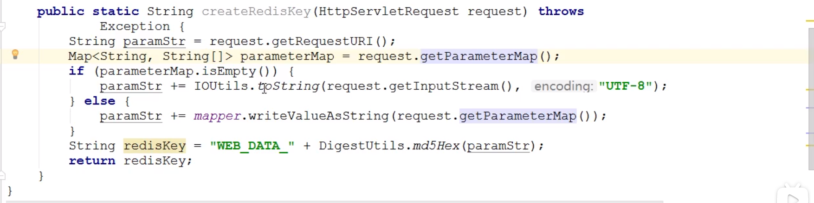
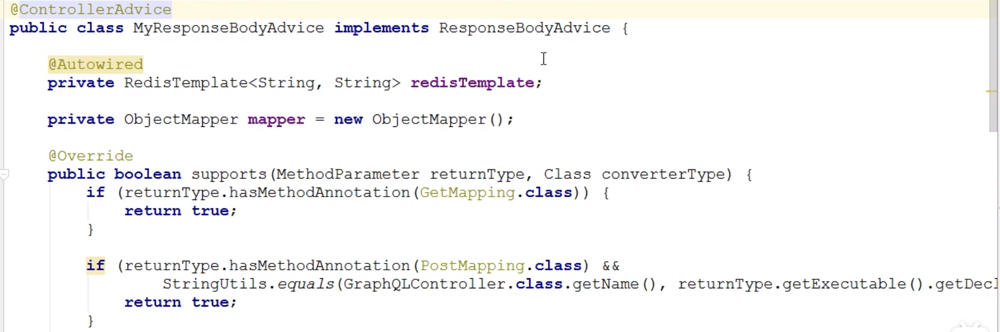
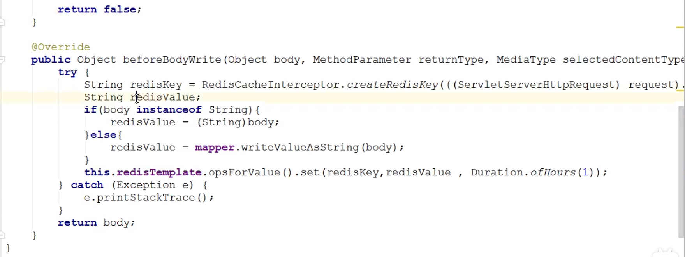
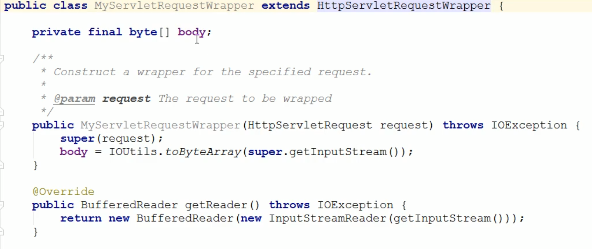
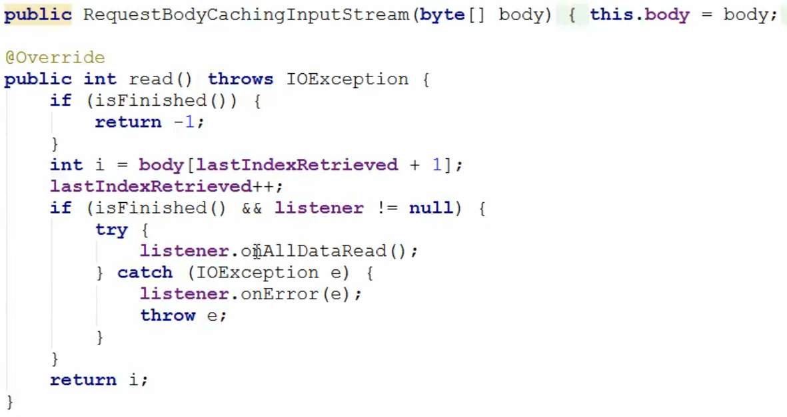
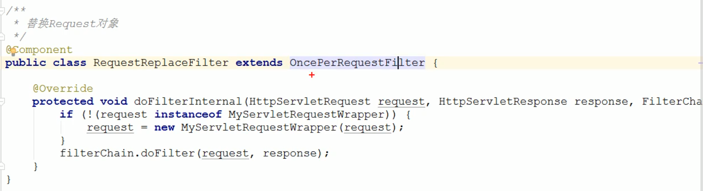

# 短信登录模块

## Token实现

### 获取验证码

- 发送验证码发一个请求，登录再发一个请求
  - 俩次都需要校验手机号，防止获取验证码后手机号修改了

### 校验验证码

- 服务器将生成的验证码作为value存入redis
  - 因为redis属于共享的内存空间，如果都用一样的key会对应不上
  - 验证码用String存储，手机号为key
- 用户输入验证码，服务器通过用户的phone查询验证码是否和redis中的一致
- 验证通过
  - 然后拿着这个phone去数据库找是否有这个用户
    - 有就登录
    - 没有就注册，然后登录
  - 登录成功后服务器生成token作为key，value为user对象存入redis，设置token的有效期
    - 将token返回给客户端保存
    - 将user对象转化为map存入，需要考虑类型问题

### 设置拦截器拦截用户访问需要用户信息的页面

- 查询ThreadLocal中的user对象
  - 不存在则拦截
  - 存在则放行

### 设置拦截器防止用户过期重新登录

- 拦截一切路径
- 通过request获取请求头中的token
- 通过token去Redis查询对应的user，返回的是一个map集合
  - 判断user是否存在即判断map是否为空
    - 为空则放行
    - 不为空
      - 则将map集合转化为user对象（BeanUtils.fill）
      - 保存到ThreadLocal中，刷新有效期 expire()，放行

## JWT实现

## 常见问题

### 集群Session共享问题

- 使用session保存收集好user对象，每一个session都有一个唯一的sessionId，在访问tomcat时sessionId会自动写入cookie中，session的原理是cookie
- 集群下不同的服务器并不共享session，导致请求切换到不同服务器时需要重新登录

# 用户缓存

- 查询数据时先去Redis缓存中找，有就返回，没有再到数据库找，减少数据库压力
- 查询数据库后将结果写入缓存，然后返回给客户端
- 主动更新策略
  - 选择删除缓存，等待有查询时在更新缓存，延迟加载
    - 如果每次更新数据库都更新缓存，无效的写操作太多
  - 选择先更新数据库再更新缓存
    - 如果先删除缓存再更新数据库，当线程1删除缓存后正在更新数据库时，线程2去查询缓存未命中，然后线程2去查数据库，会将数据库旧数据写入缓存中

## 缓存预热

- 主从之间数据吞吐量较大、数据同步操作频度高、请求数量较高，而且redis中没有数据，导致redis启动时快速宕机，所以需要进行预热
- 日常需要对数据的访问进行记录，统计热点数据
- 利用LRU（）数据删除策略，构建数据留存队列
- redis启动时加载热点数据
  - 使用脚本固定触发数据预热

## 缓存雪崩

- 在较短时段内大量的缓存失效或者redis宕机，导致大量的请求打到数据库
- 给不同的缓存key的有效期加上随机的时间
  - 不同业务过期时间不同
  - 对超级热点数据使用永久key
- 利用redis集群
- 给缓存业务添加降级限流策略
- 给业务添加**多级缓存** 
- 优化数据库中严重耗时的业务
- redis监控服务器性能指标
- 把缓存key到期删除策略改成按命中次数删除策略

## 缓存击穿

- 一个被高并发访问并且缓存重建业务较复杂的key突然失效了，无数的请求会打到数据库
- 使用互斥锁进行缓存重建
  - 没有额外内存消耗，保证一致性，实现简单，但是性能受影响，可能出现死锁
  - 利用Redis的 SETNX 实现，只有第一个执行SETNX的成功
  - 或者使用Redisson的分布式锁
- 逻辑过期
  - 即热点数据缓存不设置过期时间，而是在其对象中设置一个时间属性，在这上面设置过期时间
  - 查询缓存中这条数据时判断是否过期即可
  - 过期则加锁开启一个线程进行缓存重建
  - 性能较好，但不保证一致性，有额外内存消耗，实现复杂

## 缓存穿透

- 缓存穿透是指客户端请求的数据在缓存和数据库中的不存在，这些请求都会打到数据库
- 使用缓存空对象解决
  - 实现简单，维护方便，但会带来额外的内存消耗，可能造成短期的不一致
- 使用布隆过滤器解决，在客户和缓存之间添加
  - 内存占用少，实现复杂，存在误判
- 增强id的复杂度
- 加强用户权限校验
- 做好热点参数的限流


# GraphQL

## 使用

- 在.graphql文件中定义查询

  - 查询名、参数、返回值、返回值类型

- 在GraphQLController中添加方法

  - ```java
    @RequestMapping("graphql")
    @Controller
    public class GraphQLController{
        @Autowired
        private GraphQL graphQL;
        @GetMapping
        @ResponseBody
        public Map<String, Object> query(@RequestParam("query") String query){					
            return this.graphQL.execute(query).toSpecification();//标准输出，返回的时Map类型
        }
    }
    ```

- 创建GraphQLProvider，用于初始化GraphQL

  - 初始化GraphQL对象
  
  - 读取.graphql文件，使用GraphQLSchema解析
  
  - 指定查询的数据，创建一个MyDataFetcher接口，动态的传入查询的名称和数据
  
  - ```java
    @Component
    public class GraphQLProvide{
        private GraphQL graphQL;
        
        //MyDataFetcher实现类的集合
        @Autowired
        private List<MyDataFetcher> myDataFetchers;
        
        //初始化GraphQL对象
        @PostConstruct//在Spring初始化时执行
        public void init() throws FileNotFoundException{
            //读取外部GraphQL文件并解析
            File file = ResourceUtils.getFile("classpath:haoke.graphqls");
            this.graphQL = GraphQL.newGraphQL(buildGraphQLSchema(file)).build();
        }
        
        //构建GraphQLSchema
        private GraphQLSchema buildGraphQLSchema(File file){
            TypeDefinitionRegistry typeRegistry = new SchemaParser().parse(file);
            return new SchemaGenerator().makeExecutableSchema(typeRegistry, buildWiring());
        }  
    
        //构建RuntimeWiring 优化
        private RuntimeWiring buildWiring(){
            return RuntimeWiring.newRuntimeWiring().type("HaokeQuery", builder -> {
                for(MyDataFetcher myDataFetcher : myDataFetchers){
                    builder.dataFetcher(myDataFetcher.fieldName(), 
                                        enviroment -> myDataFetcher.dataFetcher(enviroment));
                }
                return builder;
            }).build();
        }
                                                         
        @Bean
        public GraphQL graphQL(){
            return this.graphQL;
        }
    }
    ```
  
- 创建MyDataFetcher接口，其实现类实现获取查询名和数据的功能

  - ```java
    public interface MyDataFetcher{
        //GraphQL查询的名称
        String fieldName();
        //查询数据，enviroment中有参数
        Object dataFetcher(DataFetchingEnviroment enviroment);
    }
    ```

- 创建实现类

  - ```java
    @Component
    public class XXXDataFetcher implements MyDataFetcher{
        @Autowired
        private XXXService xxxService;
        
        //GrapgQl查询名
        @Override
        public String fieldName(){
            return "xxx";
        }
        
        //通过参数查询数据
        @Override
        public Object dataFetcher(DataFetchingEnviroment enviroment){
            Long xxx = enviroment.getArgument("xxx");
            return this.xxxService.query(xxx);
        }
    }
    ```

# 分页查询

## 使用MybatisPlus中的IPage

1. 在业务层创建一个PageInfo类封装分页查询的返回值
2. 将这个PageInfo传递到消费者端
3. 消费者端创建一个TableResult类接收数据和分页信息
4. 分页信息可以再封装为一个Pagination类

# 图片存储

## 阿里云

# 聊天模块

## WebSocket + MongoDB + RocketMQ

1. 处理消息（创建消息对象，实现消息的基本功能）

   - 创建消息类并创建MongoDB中的集合（表）

     - @Indexed设置索引
     - 类中需要有User From和User to属性

   - 实现消息的增删改查

     - 查询点对点的聊天记录

       - ```java
         public List<Message> findListByFromAndTo(Long fromId, Long toId, Integer page, Integer rows){
             //设置查询条件
             //用户A发送给用户B的条件
             Criteria criteriaFrom = new Criteria().andOperator(
                 Criteria.where("from.id").id(fromId),.
                 Criteria.where("to.id").id(toId)
             );
             //用户B发送给用户A的条件
             Criteria criteriaTo = new Criteria().andOperator(
                 Criteria.where("from.id").id(toId),
                 Criteria.where("to.id").id(fromId)
             );
             //创建查询条件对象
             Criteria criteria = new Criteria().orOperator(criteriaFrom, criteriaTo);
             //设置分页，按发送时间降序
             PageRequest pageRequest = PageRequest.of(page - 1, pageSize, Sort.by(Sort.Direction.ASC, "send_data"));
             //设置查询条件，分页
             Query query = Query.query(criteria).with(pageRequest);
             //需要查询语句和对象
             return this.mongoTemplate.find(query, Message.class);
         }
         ```

2. 编写WebSocket

   - ```java
     @Component
     public class MessageHandler extends TextWebSocketHandler implements RocketMQListener<String>{
         @Override
         public void afterConnectionEstablished(WebSocketSession session) throws Exection{
             //建立连接后要做的事情
         }
         //接收消息
         @Override
         protected void handleTextMessage(WebSocketSession session, TextMessage textMessage) throws Exception{
             //将消息保存到mongodb
             message = this.messageDAO.saveMessage(message);
             //发送消息
             webSocketSession.sendMessage(new TextMessage(MAPPER.writeValueAsString(message)));
             //用户可能在其他节点中，先将消息发送到MQ中
             //需要添加tag便于消费者筛选
             this.rocketMQTemplate.convertAndSend(topic:tag, 序列化后的消息);
         }
     }
     ```

3. 设置WebSocket拦截器

   - ```java
     @Component
     public class MessageHandshakeInterceptor implements HandshakeInterceptor, WebSocketConfigurer{
         @Override
         public boolean beforeHandshake(ServerHttpRequest request, ServerHttpResponse response, WebSocketHandler wsHandler, Map<String, Object> attributes) throws Exception{
             //在客户端与服务端建立连接之前执行，握手之前进行一些处理
         }
         
         @Override
         public void registerWebSocketHandlers(WebSocketHandlerRegistry registry){
             registry.addHandler(this.messageHandler, "/ws/{uid}")
                 .setAllowedOrigins("*") //设置跨域请求
                 .addInterceptors(this);
         }
     }
     ```

4. 分布式WebSocket

   - ```java
     @Component
     @RocketMQMessageListener(
         topic = "",				  //topic
         selectorExpression = "",   //tag
         messageModel =  ,		  //消息模式：广播 / 集群
         consumerGroup = "" 		  //消费者组
     )
     public class MessageHandler implements RocketMQListener<String>{
         //接收到MQ消息
         @Override
         public void onMessage(String msg) throws Exception{
     		//找到该机器下的用户并给他发送消息
         }
     }
     ```

# 支付模块

# 秒杀模块

## 全局唯一ID

- 需要满足唯一性，安全性，高可用，高性能
- 使用Redis中的incrby实现
  - 符号位（1）+ 时间戳（31）+ 序列号（32）
    - 时间戳 = 当前时间 - 自定义的一个过去的时间常量
    - 序列号 = “一些前缀” + 当前时间 + 1
    - 返回     时间戳 << 32 | 序列号
- 使用雪花算法
  - 1bit + 时间戳（41）+ 机器id（10）+ 序列号（12）
  - 同一毫秒生成的id不超过4095，超过4095则到下一毫秒生成
  - 由于每一台机器的工作机器id不同，所以分布式环境下也不会冲突

## 防止库存超卖

- CAS

- Synchronize

- 分布式锁

## 一人一单

- 需要在扣减库存前进行判断，并且把判断过程和扣减库存用synchronize锁住
- 以userId作为锁
- 在分布式系统下无法保证，需要使用分布式锁

## 异步秒杀

- 由于当前大多数业务都是在tomcat中串行执行的，效率低
- 把秒杀券信息也保存到redis中
- 所以我们可以把判断库存、扣减库存和一人一单校验放在redis中进行
  - 使用lua脚本确保原子性
- 用户秒杀成功后将优惠券id和用户id存入**阻塞队列**中，将订单id返回给用户
- 开启线程任务不断读取**阻塞队列**中的订单异步下单

## 消息队列

- 使用Stream的Group（消费组）实现消息队列

  - 消息分流
    - 队列中的消息会分流给组内不同的消费者，从而加快消息处理速度
  - 消息标示
    - 会维护一个标识记录最后一个被处理的消息，即使宕机重启，还会从标识之后读取消息，确保每一个消息都被消费
  - 消息确认
    - 消费者获得消息后，消息会处于pending状态，并存入一个pending-list，当处理完消息后需要通过XACK来确认消息，标记消息已处理，才会从pending-list移除
  - 可以阻塞读取
  - 消息可回溯，即持久化存储

  #### 步骤

  - 创建一个StreamGroup类型的消息队列，名为stream.orders
    - `XGROUP CREATE stream.orders g1 0 MKSTREAM`
  - 使用lua脚本向消息队列中添加消息
  - 开启一个线程从消息队列中取出消息
    - 判断信息是否为空
      - 空继续下一轮循环
      - 非空解析信息然后创建订单
  - 确认消息队列中的消息
  - 如果这个过程出现异常需要处理pending-list

# 搜索模块

## 搜索

- 创建一个查询对象vo类，属性包括需要显示的信息，指定其属于ES中哪个索引，哪个type（表）

  - ```java
    @Document(indexName = "haoke", type = "house", createIndex = false)
    public class Data{
        //需要返回的数据
    }
    ```

- 创建一个搜索结果类，存放查询结果集合

  - ```java
    public class SearchResult{
        private Integer totalPage;
        private List<Data> list;
    }
    ```

- 创建`SearchController`

  - ```java
    public class SearchController{
        @Autowired
        private SearchService searchService;
        
        @GetMapping
        public SearchResult search(@RequestParam("keyWord") String kewWord,
                                   @RequestParam(value = "page", defaultValue = "1") Integer page){
          	//防止爬虫，保障ES性能，减少压力
            if(page > 100)  page = 1;
            return this.searchService.search(keyWord, page);
        }
    }
    ```

- 创建`SearchService`

  - ```java
    public class SearchService{
        @Autowired
        private ElasticsearchTemplate elasticsearchTemplate;
        //由后端指定页面数据条数
        public static final Integer ROWS = 10;
        
        public SearchResult serach(String kewWord, Integer page){
            //设置分页参数
            PageRequest pageRequest = PageRequest.of(page - 1, ROWS);
            SearchQuery searchQuery = new NativSearchQueryBuilder()
                .withQuery(Querybuilder.matchQuery("title", keyWord).operator(Operator.AND))
                .withPageable(pageRequest)
                .withHighlightFields(new HighlightBuilder.Field("title"))//不起作用
                .builder();
            AggregatedPage<HouseData> housePage = 
                this.elasticsearchTemplate.queryForPage(searchQuery, HouseData.class);
            return new SearchResult(housePage.getTotalPages(), housePage.getContent());
        }
    }
    ```

## 高亮显示

- 处理高亮和非高亮

```java
return new SearchResult(housePage.getTotalPages(), housePage.getContent(), new SearchResultMapper(){
@Override
public <T> AggregatedPage<T> mapResults(SearchResponse response, Class<T> clazz, Pageable pageable) throws Exception{
    //如果查询到的条数为0时返回空对象
    if(response.getHits().totalHits == 0) 
        return new AggregatedPageImpl<>(Collection.emptyList(), pageable, 0L);
    //接收
    List<T> list = new ArrayList<>();
    //遍历命中的数据
    for(SearchHits searchHit : response.getHits().getHits()){
        T obj = (T) ReflectUtils.newInstance(clazz);
        FieldUtils.writeField(obj, "id", searchHit.getId(), true);

        //非高亮字段的数据处理
        for(Map.Entry<String, Object> entry : searchHit.getSourceAsMap().entrySet()){
            if(null == FieldUtils.getFiled(clazz, entry.getKey(), true)) continue;
            FieldUtils.writeField(obj, entry.getKey(), entry.getValue(), true);
        }
        //处理高亮字段
        for(Map.Entry<String, HighlighField> entry : searchHit.getHighlighFields().entrySet()){
            StringBulider sb = new StringBuilder();
            Text[] fragments = entry.getValue().getFragments();
            for(Text fragment : fragments){
                sb.append(fragment.toString());
            }
            FieldUtils.writeField(obj, entry.getKey(), sb.toString(), true);
        }
        list.add(obj);
    }
    return new AggregatedPageImpl<>(list, pagable, response.getHits().totalHits);
});                                                           
```

## 热词搜索

- redis使用sortedSet

- `SearchController` 添加方法，并添加热词搜索次数

  - ```java
    public class SearchController{
        @Autowired
        private SearchService searchService;
        @Autowired
        private RedisTemplate redisTemplate;
        
        @GetMapping
        public SearchResult search(){
            if(page > 100)  page = 1;
            SearchResult search = this.searchService.search(keyWord, page);
            
            //热词加入redis
            String redisKey = "SEARCH_HOT_WORDS";
            //数据条数 = 数据页数 * 每页条数 + 当前页数据条数
            int count = ((Math.max(search.getTotalPage(), 1) - 1) * searchService.ROWS) + search.getList().size();
            this.redisTemplate.opsForZSet().add(redisKey, keyWord, count);
            //判断是否返回热词搜索
            if(search.totalPage() <=1)[
                Set set = this.redisTemplate.opsForZSet().reverseRange(redsikey, 0, 4);
                search.setHotWord(set);
            ]
            
            return search;
        }
    }
    ```

- 修改`SearchResult`

  - ```java
    @Data
    @AllArgsConstructor
    @NoArgsConstructor
    public class SearchResult{
        private Integer totalPage;
        private List<HouseData> list;
        //新增一个热词字段
        private Set<String> hotWord;
    }
    ```

## 拼音分词

- 创建索引时使用拼音分词插件，配置拼音插件

- 创建索引时为字段建立一个拼音的子字段，该子字段使用拼音分词器

  - ```json
    "properties": {
        "title": {
            "type": "text",
            "analyzer": "ik_max_word",
            "fields": {
                "type": "text",
            	"analyzer": "pinyin_analyzer"
            }
        },
        .............
    }
    ```

- 高亮会失效，使用混合搜索可解决

  - ```json
    "query":{
    	"mult_match": {
            "query": "地铁kou",
            "fields": [
                "title",
                "title.pinyin"
            ]
        },
    	"highlight": {
            "fields": {
                "title.pinyin":{},
                'title':{}
            }
        }
    }
    ```

- 修改 `SearchService` 中的实现

  - ```java
    public class SearchService{
        @Autowired
        private ElasticsearchTemplate elasticsearchTemplate;
        //由后端指定页面数据条数
        public static final Integer ROWS = 10;
        
        public SearchResult serach(){
            //设置分页参数
            PageRequest pageRequest = PageRequest.of(page - 1, ROWS);
            SearchQuery searchQuery = new NativSearchQueryBuilder()
                //这里修改为混合搜索
                .withQuery(Querybuilder.multMatchQuery(keyWord, "title", "title.pinyin").operator(Operator.AND))
                .withPageable(pageRequest)
                .withHighlightFields(new HighlightBuilder.Field("title"))
                .builder();
            AggregatedPage<HouseData> housePage = 
                this.elasticsearchTemplate.queryForPage(searchQuery, HouseData.class);
            return new SearchResult(housePage.getTotalPages(), housePage.getContent());
    }
    ```

# 地图模块

## 地图显示附近房源位置

- 需要返回给前端 房源集合（需要有经纬度信息），可以给房源添加经纬度信息，或者创建一个新的类保存（位置集合（X，Y），id，房源id，房源标题）

- 在MongoDB中为经纬度信息创建地理位置索引

  - `db.house.createIndex({loc:"id"})`

- 需要存储地图缩放比对应的公里数

- 查询MongoDB

  - ```java
    @Service
    public class MongoHouseService{
        //需要定义缩放比对应的公里数
        public static final Map<Integer, Double> BAIDU_ZOOM = new HashMap<>();
        @Autowired
        private MongoTemplate mongoTemplate;
        
        public MapHouseDataResult queryHouseData(Float lng, Float lat, Integer zoom){
            //1.5倍距离范围
            double distance = BAIDU_ZOOM.get(zoom) * 1.5 / 111.12;
            
            Query query = Query.query(Criteria.where("loc")
                                      .near(new Point(lng, lat))
                                      .maxDistance(distance));
            List<MongoHouse> mongoHouses = this.mongoTemplate.find(query, MongoHouse.class);
            List<MapHouseXY> list = new ArrayList<>();
            for(MongoHouse mongoHouse : mongoHouses){
                list.add(new MapHouseXY(mongoHouses.getLoc()[0], mongoHouse.getLoc()[1]));
            }
            return new MapHouseDataResult(list);
        }
    }
    ```

## 附近商铺

### Redis中的GEO实现

# 点赞模块

## 一人点一次

- 给Blog类中添加一个isLike字段，这个字段在数据库中不存在，标识当前用户是否点赞
  - 需要添加@TableField(exist = false)

- 利用redis的set集合实现
- 在首页的博客分页查询和根据id查询的时候判断当前用户是否点过赞，赋值给isLike字段

```java
public void likeBlog(Long id){
    //获取登录用户
    Long userId = UserHolder.getUser().getId();
    String key = "blog:liked:" + id;
    //判断当前登录用户是否点赞
    Double score 
        = stringRedisTemplate.opsForZSet.score(key, userId.toString());
    //如果未点赞，可以点赞
    if(score == null){
        //数据库点赞数+1
        boolean success = update().setSql("like = like + 1").eq("id", id).update();
    	//保存用户到redis集合中
        if(success){
            stringRedisTemplate.opsForZSet.add(key, userId.toString(), System.currentTimeMillis());
        }
    }else{
        //如果已点赞，取消点赞
        //数据库点赞数-1
        boolean success = update().setSql("like = like - 1").eq("id", id).update();
        //把用户从redis集合中删除
        if(success){
            stringRedisTemplate.opsForZSet.add(key, userId.toString());
        }
    } 	
}
```

## 点赞排行榜

- 先点赞的排在前面，需要修改之前校验一人一赞的数据类型，改为SortedSet
- 实现blogService.queryBlogLikes(Long id) 方法

```java
public List<UserDTO> queryBlogLikes(Long id){
    String key = "blog:liked:" + id;
    //查询点赞前5名的用户
    Set<String> top5 = stringRedisTemplate.opsForZSet.range(key, 0, 4);
    //如果为空返回空集合
    if(top5 == null || top5.isEmpty()) return Collections.emptyList();
    
    //解析出用户id
    List<Long> ids =  top5.stream().map(Long::valueOf).collect(Collections.toList());
    String idStr = StrUtil.join(",", ids);
    
    //根据id查询用户
    List<UserDTO> userDTO5 = userService.query()
        //为了使查询的数据按照我们想要的顺序
        .in("id", id).last("ORDER BY FIELD(id,"+idStr+")").list()
        .stream().map(user -> BeanUtil.copyProperties(user, UserDTO.calss))
        .collect(Collections.toList());
    return userDTO5;
}
```

# 关注模块

## 关注和取关

```java
public void follow(Long followUserId, Boolean isFollow){
    //获取登录用户
    Long userId = UserHolder.getUser().getId();
    
    //判断是关注还是取关
    if(isFollow){
        //设置关注信息，保存到数据库
    	Follow follow = new Follow();
    	follow.setUserId(userId);
        follow.setFollowUserId(followUserId);
        boolean isSuccess = save(follow);
        //为了后面的共同关注功能，需要将关注信息保存到redis中
        if(isSuccess){
            //存入userId 和 followUserId
            String key = "follows:" + userId;
            stringRedisTemplate.opsForSet().add(key, followUserId.toString());
        }
    }else{
        //取关
        boolean isSuccess = remove(new QueryWrapper<>()
               .eq("user_id", userId).eq("follow_user_id", followUserId));
        //删除redis中的关注信息
        if(isSuccess){
        	stringRedisTemplate.opsForSet().remove(key, followUserId.toString());
        }
    }
}
```

## 查看是否关注

```java
public boolean isFollow(Long followUserId){
    //获取登录用户
    Long userId = UserHolder.getUser().getId();
    //c数据库是否存在关联数据
    Integer count = query().eq("user_id", userId)
        .eq("follow_user_id", followUserId)).count();
    return count > 0;
}
```

## 共同关注

- 需要在用户关注的时候将用户的关注信息保存到redis中，用Set结构保存，可以查交集

```java
public List<UserDTO> followCommons(LOng id){
    //获取登录用户id
	Long id = UserHolder.getUser().getId();  
    //当前登录用户在redis中的key值
    String key1 = "follows:" + userId;
    //查看的用户在redis中的key值
    String key2 = "follows:" + id;
    //求共同关注即交集
    Set<String> intersect = stringRedisTemplate.opsForSet().intersect(key1,key2);
    //判断是否有交集,无交集返回空list
    if(intersect == null || intersect.isEmpty()) return Collections.emptyList();
    
    //解析id集合
    List<Long> ids =  intersect.stream()
        .map(Long::valueOf).collect(Collections.toList());
    
    //根据id查询用户
    List<UserDTO> users = userService.listByIds(ids)
        .stream().map(user -> BeanUtil.copyProperties(user, UserDTO.calss))
        .collect(Collections.toList());
    return users;
}
```

# 推送模块

## 推模式

- 给用户创建一个收件箱，用户发送笔记时推送到所有粉丝的收件箱，收件箱要满足可以根据时间戳排序，使用redis实现

- 用户查询收件箱时实现分页查询 （SortedSet）

- 在用户发布笔记时将博客id存入redis

- 推送笔记到粉丝邮箱

  - ```java
    //查询笔记作者的所有粉丝
        List<Follow> follows = followService.query().eq("follow_user_id",user.getId()).list();
    //推送笔记id给所有粉丝
        for(Follow follow : follows){
            //获取粉丝id
            Long userId = follow.getUserId();
            //推送
            String key = "feed:" + userId; 
            stringRedisTemplate.opsForZSet().add(key, blog.getId().toString(), System.currentTimeMillis());
        }
    ```

- 粉丝邮箱读取笔记

  - 需要先创建滚动分页的dto类

    - ```JAVA
      @Data
      public class ScoreResult{
          //查询的博客
          private List<?> list;
          //上一次查询的时间，用于下一次查询作为最小值
          private Long minTime;
          private Integer offset;
      }
      ```

  - 读取收件箱封装到ScoreResult中

    - ```java
      public ScoreResult queryBlogOfFollow(Long max, Integer offset){
          //获取当前用户
          Long userId = UserHolder.getUser().getId(); 
          //查询收件箱
          String key = "feed:" + userId;
          Set<ZSetOperations.TypedTuple<String>> typedTuples = stringRedisTemplate
              //offset：跳过最大值的个数，0则包含
              .opsForZset().reverseRangeByScoreWithScores(key, 0, max, offset, 2);
          if(typedTuples == null || typedTuples.isEmpty()) return;
          
          //解析数据
          List<long> ids = new ArrayList<>(typedTuples.size());
          long minTime = 0;
          int os = 1;
          for(ZSetOperations.TypedTuple<String> tuple : typedTuples){
              //获取id
              ids.add(Long.valueOf(tuple.getValue()));
              //获取分数（时间戳）
              long time = tuple.getScore().longValue();
              if(time == minTime){
                  os++;
              }else{
                  minTime = time;
                  os = 1;
              }
          }
          //根据id查询blog
          String idStr = StrUtil.join(",", ids);
          List<Blog> blogs = query().in("id", ids).last("ORDER BY FIELD(id,"+idStr+")").list();
          
          for(Blog blog : blogs){
              //查询blog有关的用户
              queryBlogUser(blog);
              //查询Blog是否被点赞
              isBlogLiked(blog);
          }
          //返回
          ScrollResult r = new ScrollResult();
          r.setList(blogs);
          r.setOffset(os);
          r.setMinTime(minTime);
          return r;
      }
      ```

## 拉模式

## 推拉结合

# 签到模块

## 使用Reids的BitMap实现

- 签到
  - `stringRedisTemplate.opsForValue.setBit(key, dayOfMonth - 1, true)` 
- 统计
  - `List<Long> result = stringRedisTemplate.opsForValue().bitField(
        	key, BitFieldSubCommands.create()
            .get(BitFieldSubCommands.BitFieldType.unsigned(dayOfMonth))
            .valueAt(0)
        );`

# 集群搭建

## Mysql集群

## Redis集群

1. 使用Docker搭建redis集群，使用host网络类型，配置

   - 拉取镜像-创建容器-启动容器指定host网络类型

2. 创建`ClusterConfigurationProperties` 

   - ```java
     @Component
     @ConfigurationProperties(prefix="spring.redis.cluster")
     @Data
     public class ClusterConfigurationProperties{
         //存放所有节点的ip地址
         private List<String> nodes;
         //最大重定向次数
         private Integer maxRedirects;
     }
     ```


3. 建立连接

   - ```java
     @Configuration
     public class RedisClusterConfig{
         @Autowired
         private ClusterConfigurationProperties clusterProperties;
         
         @Bean
         public RedisConnectionFactory connectionFactory(){
             RedisClusterConfiguration configuration = new RedisClusterConfiguration(clusterProperties.getMaxRedirects());
             configuration.setMaxRedirects(clusterProperties.getMaxRedirects());
             return new JedisConnectionFactory(configuration);
         }
         @Bean
         public RedisTemplate<String, String> redisTemplate(RedisConnectionFactory redisConnectionfactory){
             RedisTemplate<String, String> redisTemplate = new redisTemplate<>();
             redisTemplate.setConnectionFactory(redisConnectionfactory);
             redisTemplate.setKeySerializer(new StringRedisSerializer());
             redisTemplate.setValueSerializer(new StringRedisSerializer());
             redisTemplate.afterPropertiesSet();
             return redisTemplate;
         }
     } 
     ```


4. 采用统一控制缓存逻辑，使用拦截器实现

   - ```java
     public class Interceptor(){
         @Override
         public boolean preHandle(HttpServletRequest request, HttpServletResponse response, Object handler){
             if(StringUtils.equalsIgnoreCase(request.getMethod(), "OPTIONS")){
                 return true;
             }
             //判断请求方式
             if(!StringUtils.equalsIgnoreCase(request.getMethod(), "GET")){
                 //非Get，如果不是graphql，则放行
                 if(!StringUtils.equalsIgnoreCase(request.getRequestURI(), "/graphql")){
                     return true;
                 }
             }
             //通过缓存做命中，查询redis，redisKey ? 组成md5
             String redisKey = createRedisKey(request);
             String data = this.redisTemplate.opsForValue().get(redisKey);
             if(StringUtils.isEmpty(data)) return true;
             //支持跨域
             response.setHeader("Access-Control-Allow-Origin", "*");
             response.setHeader("Access-Control-Allow-Methods", "GET,POST,PUT,DELETE,OPTIONS");
             response.setHeader("Access-Control-Allow-Credentials", "true");
             response.setHeader("Access-Control-Allow-Headers", "Content-Type,X-Token");
             response.setHeader("Access-Control-Allow-Credentials", "true");
             response.getWriter().write(data);
             return false;
         }
         public static String createRedisKey(HttpServletRequest request) throws Exception{
             String paramStr = request.getRequestURI();
             Map<String, String[]> parameterMap = request.getParameterMap();
             if(parameterMap.isEmpty()){
                 paramStr += IOUtils.toString(request.getInputStream(), "UTF-8");
             }else{
                 paramStr += mapper.writeValueAsString(request.getParameterMap());
             }
          }
     }
     ```

  - 

5. 将拦截器注入Spring容器

  - 
  - 将数据库查询结果写入Redis缓存中
    - 使用**ResponseBodyAdvice** 在响应结果被处理前拦截，拦截的逻辑自己实现，这样就可以将响应结果写入缓存中了
      - 
      - 
        - @ControllerAdvice进行拦截
        - supprot方法返回true才会执行beforeBodyWrite方法

## ES集群

### 节点

- master节点
  - 配置文件中node.master设置为true，则有资格被选为master节点
  - 创建/删除索引，管理非master
- data节点
  - 配置文件中node.data设置为true，就有资格
  - CRUD
- 客户端节点
  - node.master和node.data都为false
  - 响应客户的请求，转化请求
- 部落节点
  - 配置tribe.*，则是一个部落节点
  - 可以连接多个集群，在所有集群上进行搜索等操作

### 步骤

- 创建es-cluster文件夹，在下面创建节点目录
- 需要将es下的`elasticsearch.yml`和`jvm.options`拷贝到节点目录下
- 编辑`elasticsearch.yml`，添加节点名字
  - `cluster.name: 集群名字`
  - `node.name: 节点名字`
  - `http.port: 端口号`
  - `discovery.zen.ping.unicast.hosts: ["广播地址"]`
  - `discovery.zen.minimum_master_nodes: 最小master节点数`
  - `node.master: 是否为master节点`
  - `node.data: 是否为data节点`
- 编辑`jvm.options` ，修改jvm最大和最小堆内存
- docker创建容器进行配置文件挂载

### 分片和副本

- 一个分片是一个最小级别的工作单元，他只是保存了索引中所有数据的一部分
- 我们需要知道分片就是一个Lucene实例，并且它本身就是一个完整的搜索引擎，应用程序不会和它直接通信
- 分片可以是主分片或者是复制分片
- 索引中的每个文档属于一个单独的主分片，所以主分片的数量决定了所应最多能存储多少数据
- 复制分片只是主分片的一个副本，它可以防止硬件故障导致的数据丢失，同时可以提供读请求，比如搜索或者从别的分片取回文档
- 当索引创建完成的时候，主分片的数量就固定了，但是复制分片的数量可以随时调整

### 脑裂

- master发生宕机，然后集群重新选举master，宕机的master恢复后，集群中出现了俩个master，会分成俩个集群
- 设置选举master数为：（N/2）+ 1 可解决

## RocketMQ集群

## MongoDB集群

# 开发中遇到的问题

## redis集群ip问题

- docker生成的主机ip地址，无法搭建集群
- 容器的ip地址，可以搭建集群，但是集群在客户端不可用，服务端可用
- 主机的ip地址，无法搭建集群
- 解决方案：

  - 创建容器的时候指定网络类型为host

  - 弊端：不安全，容器ip地址暴露

## Request流只能读取一次

- 包装Request解决
- 通过过滤器进行包装request对象
  - 用instanceof 判断是否包装过

- 创建`MyServletRequestWrapper` 继承 `HttpServletRequestWrapper` 
  - 
  - 
  - 
- 通过过滤器包装request
  - 

## Session共享问题

- 分布式WebSocket解决

## Netty冲突

- Redis中使用到了netty，elasticSearch中也引入了netty，发生冲突
- 需要在启动类中添加
  - `System.setProperty("es.set.netty.runtime.available.processors", "false")`

## 解决表名大小写敏感问题

https://www.cnblogs.com/ljincheng/p/13581326.html

只有在初始化的时候才可以设置

## 终端不能输入中文

`vim /etc/profile` 

输入 `export LC_CTYPE='zh_CN.UTF-8' ` 

## 跨域问题

- @CrossOrigin

- ```java
  //支持跨域
  response.setHeader("Access-Control-Allow-Origin", "*");
  response.setHeader("Access-Control-Allow-Methods", "GET,POST,PUT,DELETE,OPTIONS");
  response.setHeader("Access-Control-Allow-Credentials", "true");
  response.setHeader("Access-Control-Allow-Headers", "Content-Type,X-Token");
  response.setHeader("Access-Control-Allow-Credentials", "true");
  ```

## 非法访问异常

- Jdk > 1.8   虚拟机加参数
  - `--add-opens java.base/java.lang=ALL-UNNAMED`
